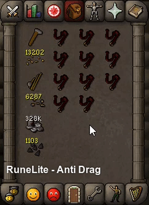

# Anti Drag Configuration
This plugin will prevent you from dragging an item while holding the shift key for a specified delay.

## Settings

### Drag Delay [Numerical Value]

(Default 30) This setting defines how long the anti-drag plugin will work in client ticks (20 milliseconds) until it allows the item to move with the mouse.

### On Shift Only

Configures whether to only adjust the delay while holding shift. Required for anti drag in PvP scenarios.
