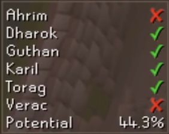
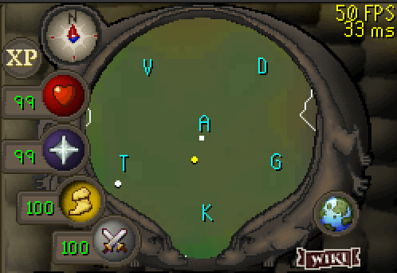
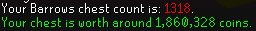
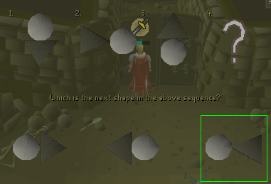

# Barrows Brothers Configuration

## Settings

### Show Brothers location

Displays the first letter of the Barrows Brothers' names on the minimap above their respective hills.

### Show value of Chests

Displays total Exchange value of chests when opened.

### Brother location color

Changes the color of the initials displayed on the minimap.

### Dead Brother loc. color

Changes the color of the initials displayed on the minimap once the brother has been killed.

### Show Puzzle Answer

Shows a border around the correct answer for the door.

### Show Prayer Drain Timer

Shows estimated time until prayer drain.
