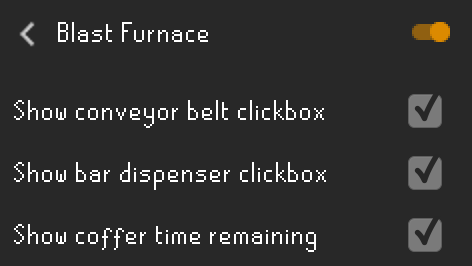
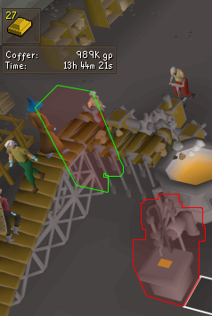

## Blast Furnace Configuration

The Blast Furnace plugin displays a tooltip that shows the bars available in the furnace, current coffer gp amount, coffer time remaining, and displays an overlay on the conveyor belt and bar dispenser's clickbox.

## Settings

### Show conveyor belt clickbox

Displays an overlay of the clickbox for the ore conveyor belt.

### Show bar dispenser clickbox

Displays an overlay of the clickbox for the bar dispenser.

### Show coffer time remaining

Displays the amount of time remaining until the coffer runs out of gp.
