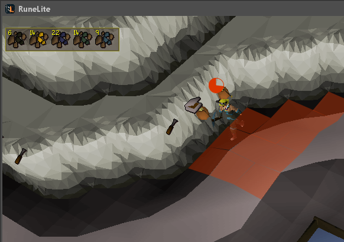

The Blast Mine plugin draws overlays over rocks to show their next mining step, draws an explosion timer and radius overlay, and replaces the official blast mine overlay with a tidier Runelite overlay

## Settings

### Show ore overlay

Configures whether or not the ore count overlay is displayed

### Show icons overlay

Configures whether or not the rock icon overlay is displayed

### Show timer overlay

Configures whether or not the explosion timer overlay is displayed

### Show explosion warning

Configures whether or not the explosion radius warning overlay is displayed

### Timer color

Color of the timer overlay

### Warning color

Color of the explosion radius warning overlay
