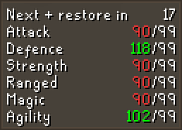
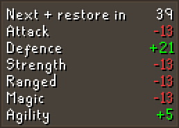
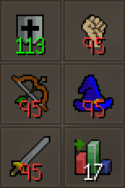

# Boost Information Configuration

## Settings

### Display Boosts

Configures which skill boosts to display.

### Use Relative Boosts

Displays your boosted stat levels as a measure of how much they are boosted (e.g. +4).

### Display as infoboxes.

Displays your boosts as icon boxes rather than a text box.

### Display next change

Displays a countdown from 60 seconds (or 90 seconds with Preserve activated) that indicates when stats are naturally restored by 1. The client has to see a combat buff (e.g. attack potion) drain once per ingame session to be able to display the combat buff drain timer. This is not required for the non-combat buff drain timer or the debuff restoration timer. 

### Boost Amount Threshold

The amount of levels boosted at which the value is displayed in a different color. A value of `0` disables the feature.

### Notify on boost threshold

Configures whether or not to send a notification when the `Boost amount threshold` is reached.
