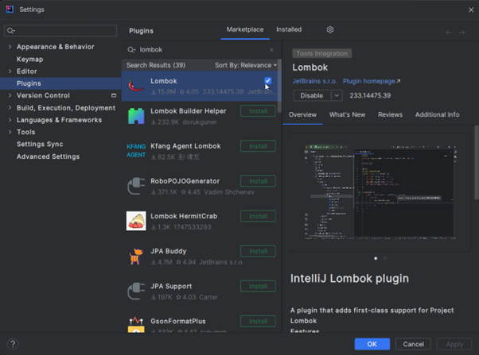

<!-- omit in toc -->
# Table of Contents

- [Getting started](#getting-started)
  - [Importing the project](#importing-the-project)
  - [Installing Lombok](#installing-lombok)
  - [Building the project](#building-the-project)
  - [Running the project](#running-the-project)
  - [Conclusion](#conclusion)
- [Troubleshooting](#troubleshooting)
  - [Missing git](#missing-git)
  - [Missing JDK](#missing-jdk)
  - [Client failing to start](#client-failing-to-start)

# Getting started

For working with this project, [IntelliJ IDEA](https://www.jetbrains.com/idea/download) is our recommended IDE and the one used by most collaborators. The free community edition has everything you'll need to start testing and contributing real improvements to the project.

You can build RuneLite locally using [JDK 11](https://adoptium.net/temurin/releases/?version=11). We recommend installing the JDK through IntelliJ and selecting vendor `Eclipse Temurin (AdoptOpenJDK HotSpot)` version `11`. The codebase supports language features up to Java 11.

## Importing the project

After launching IntelliJ IDEA for first time, you will see IntelliJ welcome window. You will now need to clone RuneLite repository from git:


After clicking on that you will be greeted with prompt. You can either enter the RuneLite repository `https://github.com/runelite/runelite` or your own GitHub fork, if you've created one.

**NOTE**: If you plan to make a Pull Request, you must fork the RuneLite repository, and clone from your fork.

The prompt should look something like this (if you have issues with finding git.exe see [Troubleshooting](#troubleshooting) section):


Click *Test* to verify if your entered URL is correct and then click on *Clone*. Now IntelliJ should start cloning the repository:


After the cloning process is done you should be greeted with prompt asking you if you want to open the project, just click *Yes*:


If everything went well, you should be able to see something like this:


## Installing Lombok

When first viewing the project in IntelliJ IDEA you may come across this error:


This is because you do not have the [Lombok Plugin](https://plugins.jetbrains.com/plugin/6317-lombok-plugin) installed.

Navigate to the **Plugins** tab under the **File > Settings** menu (**IntelliJ IDEA > Preferences** for Mac). Click the **Marketplace** button and search for **Lombok** to find it. Install the plugin and restart IntelliJ IDEA.



Success! You should no longer be getting ``Cannot resolve symbol`` or ``Cannot resolve method`` errors.

## Building the project

RuneLite is using [Maven](https://maven.apache.org/) as build tool. It is used for dependency management, resource generation, running tests and any other tooling needed to properly build, run and deploy RuneLite.

So, to actually run RuneLite, we first need to invoke Maven.

Locate *Maven* on right-side of the screen until you open something like this:


Standard maven goal is *Install* so let's run that. Locate *Runelite (root)* project in dropdown and navigate to `RuneLite (root) -> Lifecycle -> Install` and right-click the option and select `Run Maven Build`:


If you are having issues with missing JDK see [Troubleshooting](#troubleshooting) section.
You can now save this build step as *Run configuration*, just right click *Install* again and select *Create..* (*Modify Run Configuration...* in IntelliJ 2021.2), window like this should pop-up, so just hit *Ok* (you can append `-DskipTests` for faster builds):


Now, we need to tell IntelliJ to pick up changes based on Maven build (it should do that automatically, but sometimes it doesn't). So, still in same Maven window, just click the Refresh icon:


## Running the project

Now locate *Project* in sidebar and click that open project view, and expand the tree to `runelite/runelite-client/src/main/java/net/runelite/client`. And all you need to do now is right-click `RuneLite` class and select run, and you are done, RuneLite should open:


If you are having any issues with this step see [Troubleshooting](#troubleshooting) section.

## Conclusion

Success! You can switch between running the client and building the Maven project by switching between the **RuneLite** configuration and your custom Maven configuration (should be named *runelite-parent [install]* by default):


# Troubleshooting

## Missing git

If you are getting error about `git.exe` (or `git` on linux and mac) missing, you will need to first download and install Git for your OS. Git is version control software and implementation that RuneLite uses to store and track history of it's source code. To download git, just [go here and select your OS version](https://git-scm.com/downloads).

## Missing JDK

If you are getting errors about missing JDK, make sure to install JDK 11 (see start of this page) and then navigate to *File* -> *Project Structure* like this:


Then press *+* button and *Add JDK* and locate directory of your installed JDK:


## Client failing to start

If the client fails to boot or if the applet does not appear, try running the Maven build again with the following command:  
`clean install -DskipTests -U`


If that also doesn't work, feel free to ask for help in the discord server. Here are few helpful tips:

<!-- omit in toc -->
#### Make sure your branch is up to date with master

To sync your fork simply run

```
git checkout master && git fetch upstream && git rebase upstream/master && git checkout - && git rebase -
```
or update the project from IntelliJ:

 

<!-- omit in toc -->
#### Make sure IntelliJ is picking up changes from Maven

If you are unsure, run: *Maven Projects* > *Reimport all maven projects* in IntelliJ (or *Ctrl* + *Shift* + *A* and type *Reimport all maven project*).

Happy development!

<!-- omit in toc -->
#### JDKs 16+

You have to add the following extra VM arguments in order to use these java versions:

<!-- omit in toc -->
##### Windows/Linux
```
--add-opens=java.desktop/sun.awt=ALL-UNNAMED
```

<!-- omit in toc -->
##### Mac
```
--add-opens=java.desktop/com.apple.eawt=ALL-UNNAMED --add-opens=java.desktop/sun.awt=ALL-UNNAMED
```
