<!-- omit in toc -->
This guide is for core client development. For plugin hub development, see [[Developer Guide]].

# Table of Contents

- [Getting started](#getting-started)
  - [Importing the project](#importing-the-project)
  - [Installing Lombok](#installing-lombok)
  - [Configuring the project](#configuring-the-project)
  - [Building the project](#building-the-project)
  - [Running the project](#running-the-project)
  - [Conclusion](#conclusion)
- [Troubleshooting](#troubleshooting)
  - [WARNING: An illegal reflective access operation has occurred](#WARNING-An-illegal-reflective-access-operation-has-occurred)
  - [Missing git](#missing-git)
  - [Tests are failing](#tests-are-failing)
  - [Pluginhub failing to load](#pluginhub-failing-to-load)
  - [Client failing to start](#client-failing-to-start)

# Getting started

For working with this project, [IntelliJ IDEA](https://www.jetbrains.com/idea/download) is our recommended IDE and the one used by most collaborators. The free community edition has everything you'll need to start testing and contributing real improvements to the project.

You can build RuneLite locally using [JDK 11](https://adoptium.net/temurin/releases/?version=11). We recommend installing the JDK through IntelliJ and selecting vendor `Eclipse Temurin (AdoptOpenJDK HotSpot)` version `11`. The codebase supports language features up to Java 11.

## Importing the project

After launching IntelliJ IDEA for first time, you will see IntelliJ's welcome window. You will now need to clone the RuneLite repository from git; to do this you can click the `Get from VCS` button.

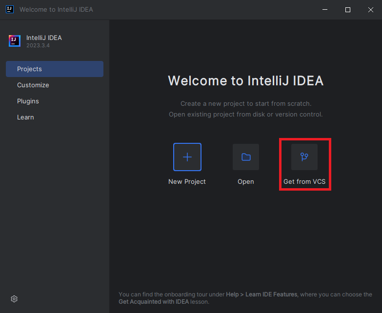

If you're presented with the editor instead of the welcome screen, click `File > New > Project from Version Control…`.

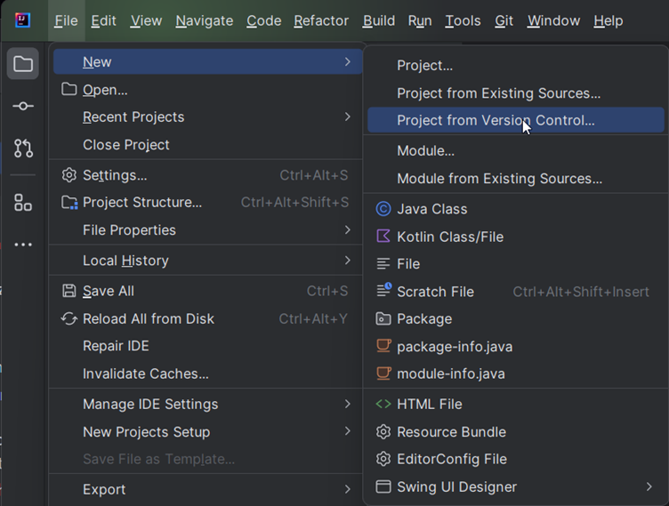

After clicking on that you will be greeted with a prompt. You can either enter the RuneLite repository `https://github.com/runelite/runelite` or your own GitHub fork, if you've created one.  
You can also specify a directory where you'd like to save the RuneLite files to in this prompt. If Git is not installed, click on ``Download and install`` to install Git.

**NOTE**: If you plan to make a Pull Request, you must fork the RuneLite repository, and clone from your fork.


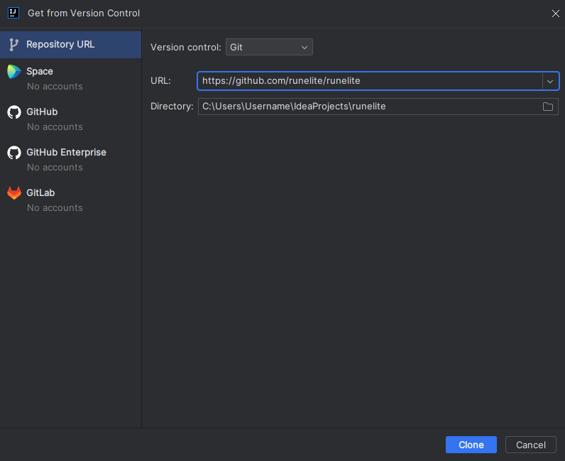

After cloning is done you will be presented with a `Trust and open Project 'runelite'?` popup. Click `Trust Project`.


## Installing Lombok

When first viewing the project in IntelliJ IDEA you may come across this error:

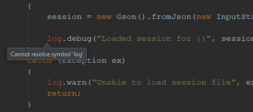

This is because you do not have the [Lombok Plugin](https://plugins.jetbrains.com/plugin/6317-lombok-plugin) installed.

Navigate to the `Plugins` tab under the `(Main Menu) > File > Settings` menu (`IntelliJ IDEA > Preferences` for Mac). Click the `Marketplace` button and search for **Lombok** to find it. Install the plugin and restart IntelliJ IDEA.


Success! You should no longer be getting ``Cannot resolve symbol`` or ``Cannot resolve method`` errors.


## Configuring the project

We need to make sure that the correct SDK is selected for RuneLite. To do that go to `File > Project Structure…`

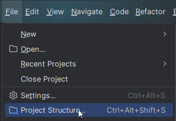

Go to the `Project Settings > Project` tab and open the ``SDK`` dropdown menu. Click on ``Download JDK...``

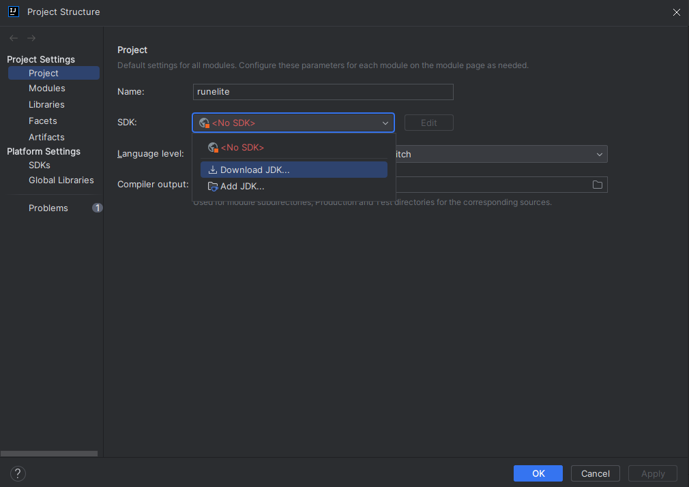

Choose ``version`` ``11`` and ``vendor`` ``Eclipse Temurin (AdoptOpenJDK Hotspot)``. Then press ``Download`` to download the JDK.

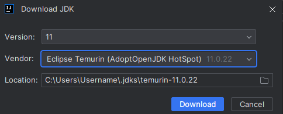

Set the ``Language level`` to 11 and press ``OK`` to save the changes.

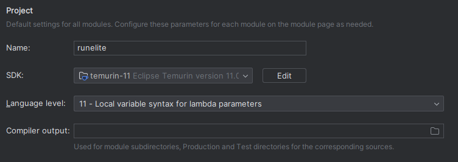

## Building the project 

RuneLite is using [Maven](https://maven.apache.org/) as build tool. It is used for dependency management, resource generation, running tests and any other tooling needed to properly build, run and deploy RuneLite.

So, to actually run RuneLite, we first need to invoke Maven.

Locate *Maven* on the right-side of the screen. Then navigate to ``RuneLite`` (parent) > ``Lifecycle``, right-click ``install``, and press ``Run Maven Build``:

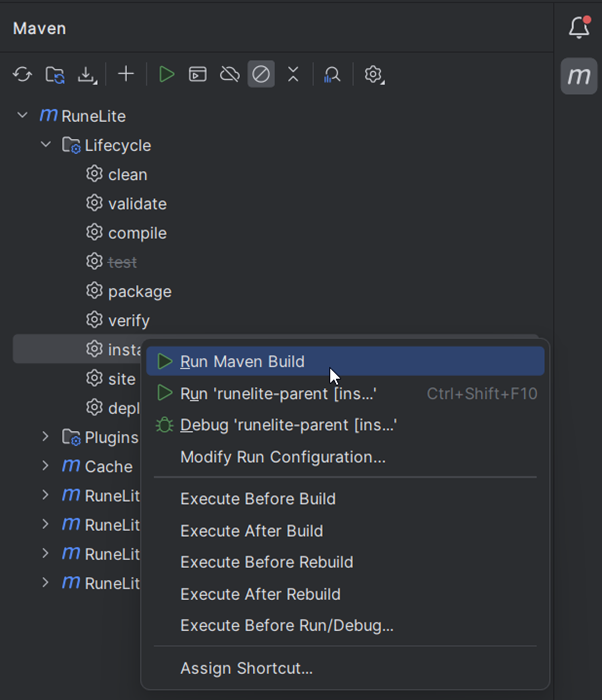

At this point, it should start the build, which might take a while. Once the process is done, you should see a message to let you know the final status of the build. Don't worry if there are build or test failures. We can fix those later.

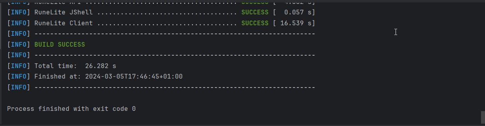

It is highly recommended to create custom ``Run Configurations``. In the Maven window, right-click on ``RuneLite`` > ``Lifecycle`` > ``install``, and select ``Modify Run Configuration...``

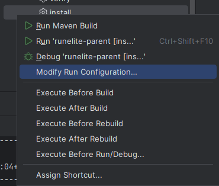

Here you can choose a name, such as ``runelite-parent [install] skip tests``, and add a Maven command. For faster builds, try ``install -DskipTests``. This will skip the tests (and test failures).

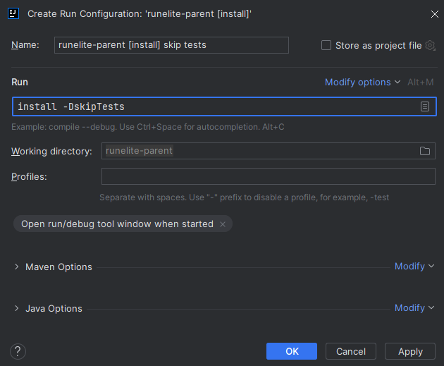

Press ``OK``. You can now easily run your run configurations in the Maven window by right-clicking ``RuneLite`` (parent) > ``Run Configurations`` > ``runelite-parent [install] skip tests`` and selecting ``Run``.  
Alternatively, you can select your run configuration in the dropdown box at the top and hit the ``Run`` button.

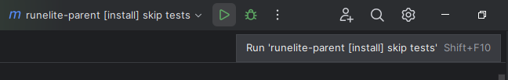

Other useful run configurations include:  
``clean install -DskipTests -U`` which is your first troubleshooting step that you should run multiple times in case of a build failures  
``-Dcheckstyle.skip=false checkstyle:check`` to only run checkstyle without building the client  
``surefire:test`` to only run the tests without building the client  

We now need to tell IntelliJ to pick up changes based on Maven build (it should do that automatically, but sometimes it doesn't). Click on `Generate Sources and Update folders for all projects` in the Maven window.

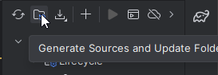

## Running the project

Now locate `Project` in the sidebar, and in the project view expand the tree to `runelite/runelite-client/src/main/java/net/runelite/client`. 
And all you need to do now is right-click the `RuneLite` class and select `Run 'RuneLite.main()'`

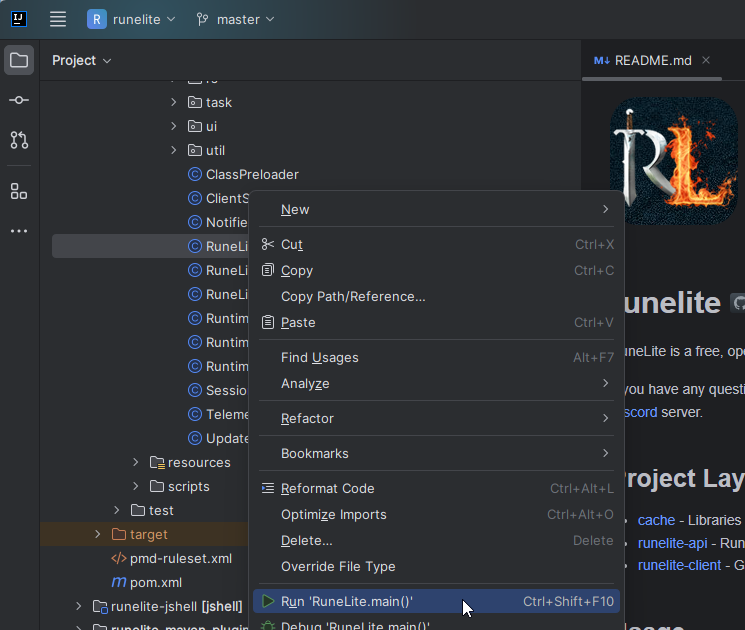

If you receive a notification regarding Lombok's annotation processing, press ``Enable annotation processing``:

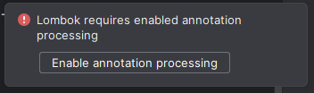

In case of errors regarding missing classes, click the ``Reload All Maven Projects`` in the Maven tab.

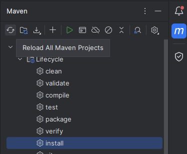

And you are done! RuneLite should open.

If you are having any issues with this step see the [Troubleshooting](#troubleshooting) section.

## Conclusion

Success! You can switch between running the client and building the Maven project by switching between the ``RuneLite`` configuration and your custom Maven configuration (e.g. ``runelite-parent [install]``):

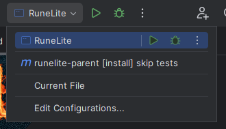

### Hot reloading
To help enable a faster edit-run-test development loop, check out [JetBrains's official documentation on hot reloading](https://www.jetbrains.com/help/idea/altering-the-program-s-execution-flow.html#reload_classes).

# Troubleshooting

## WARNING: An illegal reflective access operation has occurred
You can ignore this.

## Missing git

If you are getting error about `git.exe` (or `git` on linux and mac) missing, you will need to first download and install Git for your OS. Git is version control software and implementation that RuneLite uses to store and track history of it's source code. To download git, just [go here and select your OS version](https://git-scm.com/downloads).

## Tests are failing

If you've followed all instructions correctly, try deleting the `%TEMP%/cache-165` folder or skipping the tests by running a custom run configuration as outlined in [Building the project](#building-the-project).

## Pluginhub failing to load

External plugins are not installed by default in development versions of RuneLite because the development versions are snapshot versions, whereas we only provide builds of pluginhub plugins for stable releases of RuneLite. Usually you can pass `-Drunelite.pluginhub.version=<current RL version>` as a VM option (to enable VM Options, follow the guide in [[Using the client developer tools]]) to load the plugins built against the release into your build, which will work if there are no [Application Binary Interface](https://en.wikipedia.org/wiki/Application_binary_interface) (ABI) changes.

How can you tell if there are ABI changes? If some existing core API changes or is removed e.g. if we remove some `Client` method which a hub plugin uses, the RuneLite client will crash when a hub plugin loaded this way tries to run it. If there are ABI changes, build the plugins yourself and place them into the `sideloaded-plugins` directory when running in developer mode.

## Client failing to start

If the client fails to boot or if the applet does not appear, try running the Maven build again with the following command:  
`clean install -DskipTests -U`


If that also doesn't work, feel free to ask for help in the [Runelite Discord](https://runelite.net/discord) server. Here are few helpful tips:

<!-- omit in toc -->
#### Make sure your branch is up to date with master

To sync your fork simply run

```
git checkout master && git fetch upstream && git rebase upstream/master && git checkout - && git rebase -
```
or update the project from IntelliJ:

 

<!-- omit in toc -->
#### Make sure IntelliJ is picking up changes from Maven

If you are unsure, run: *Maven Projects* > *Reimport all maven projects* in IntelliJ (or *Ctrl* + *Shift* + *A* and type *Reimport all maven project*).

Happy development!

<!-- omit in toc -->
#### JDKs 16+

You have to add the following extra VM arguments in order to use these java versions:

<!-- omit in toc -->
##### Windows/Linux
```
--add-opens=java.desktop/sun.awt=ALL-UNNAMED
```

<!-- omit in toc -->
##### Mac
```
--add-opens=java.desktop/com.apple.eawt=ALL-UNNAMED --add-opens=java.desktop/sun.awt=ALL-UNNAMED
```
