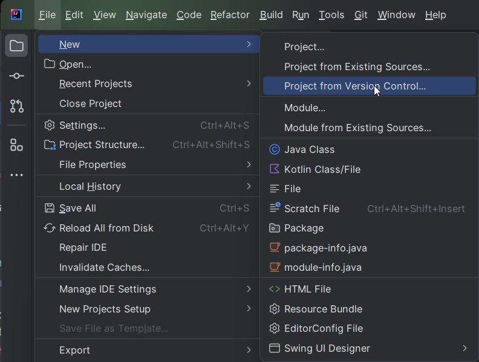

<!-- omit in toc -->
This guide is for core client development. For plugin hub development, see [[Developer Guide]].

# Table of Contents

- [Getting started](#getting-started)
  - [Importing the project](#importing-the-project)
  - [Installing Lombok](#installing-lombok)
  - [Configuring the project](#configuring-the-project)
  - [Building the project](#building-the-project)
  - [Running the project](#running-the-project)
  - [Conclusion](#conclusion)
- [Troubleshooting](#troubleshooting)
  - [WARNING: An illegal reflective access operation has occurred](#WARNING-An-illegal-reflective-access-operation-has-occurred)
  - [Missing git](#missing-git)
  - [Tests are failing](#tests-are-failing)
  - [Pluginhub failing to load](#pluginhub-failing-to-load)
  - [Client failing to start](#client-failing-to-start)

# Getting started

For working with this project, [IntelliJ IDEA](https://www.jetbrains.com/idea/download) is our recommended IDE and the one used by most collaborators. The free community edition has everything you'll need to start testing and contributing real improvements to the project.

You can build RuneLite locally using [JDK 11](https://adoptium.net/temurin/releases/?version=11). We recommend installing the JDK through IntelliJ and selecting vendor `Eclipse Temurin (AdoptOpenJDK HotSpot)` version `11`. The codebase supports language features up to Java 11.

## Importing the project

After launching IntelliJ IDEA for first time, you will see IntelliJ's welcome window. You will now need to clone the RuneLite repository from git; to do this you can click the `Get from VCS` button.


If you're presented with the editor instead of the welcome screen, click `File > New > Project from Version Control…`.



After clicking on that you will be greeted with a prompt. You can either enter the RuneLite repository `https://github.com/runelite/runelite` or your own GitHub fork, if you've created one.  
You can also specify a directory where you'd like to save the RuneLite files to in this prompt. If Git is not installed, click on ``Download and install`` to install Git.

**NOTE**: If you plan to make a Pull Request, you must fork the RuneLite repository, and clone from your fork.


After cloning is done you will be presented with a `Trust and open Project 'runelite'?` popup. Click `Trust Project`.


## Configuring the project

We need to make sure that the correct SDK is selected for RuneLite. To do that go to `File > Project Structure…`


Go to the `Project Settings > Project` tab and open the ``SDK`` dropdown menu. Click on ``Download JDK...``


Choose ``version`` ``11`` and ``vendor`` ``Eclipse Temurin (AdoptOpenJDK Hotspot)``. Then press ``Download`` to download the JDK.


Set the ``Language level`` to 11 and press ``OK`` to save the changes.


## Building the project

To run RuneLite, locate `runelite-client/src/main/java/net/runelite/client/RuneLite.java` and right-click on it.
Select `Run RuneLite.main()` and wait a while for the client to build and start.

### Plugin Hub Plugins

We don't provide builds of pluginhub plugins for snapshot versions. 
To run plugins from the latest RuneLite release,
add `-Drunelite.pluginhub.version=<current RL version>` as a VM option in your run configuration
(if you do not see VM options, select More Options -> Add VM Options).

### Hot reloading
To help enable a faster edit-run-test development loop, check out [JetBrains's official documentation on hot reloading](https://www.jetbrains.com/help/idea/altering-the-program-s-execution-flow.html#reload_classes).

# Troubleshooting

## WARNING: An illegal reflective access operation has occurred
You can ignore this.

## Missing git

If you are getting error about `git.exe` (or `git` on linux and mac) missing, you will need to first download and install Git for your OS. Git is version control software and implementation that RuneLite uses to store and track history of it's source code. To download git, just [go here and select your OS version](https://git-scm.com/downloads).

## Tests are failing

If you've followed all instructions correctly, try deleting the `%TEMP%/cache-165` folder or skipping the tests by running a custom run configuration as outlined in [Building the project](#building-the-project).

## Client failing to start

If the client fails to boot, or if the client starts with a white or black screen, 
try running the Gradle target `:cleanAll`.

If that also doesn't work, feel free to ask for help in the [Runelite Discord](https://runelite.net/discord) server. Here are few helpful tips:

<!-- omit in toc -->
#### Make sure your branch is up to date with master

To sync your fork simply run

```
git pull --rebase upstream/master
```

If you get an error of `fatal: 'upstream' does not appear to be a git repository`,
add the RuneLite repository as an upstream with
`git remote add upstream https://github.com/runelite/runelite.git`.

<!-- omit in toc -->
#### Make sure IntelliJ is picking up changes from Gradle

If you are unsure, run: *Gradle* > *Sync All Gradle Projects* in IntelliJ (or *Ctrl* + *Shift* + *A* and type *Sync All Gradle Projects*).

Happy development!

<!-- omit in toc -->
#### macOS JDKs 17+

In order to use JDK 17+ on macOS, you will need to add the following VM options:
```
--add-opens=java.desktop/com.apple.eawt=ALL-UNNAMED
```
