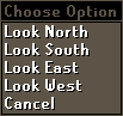

# Camera Configuration

## Camera
### Expand Inner Zoom Limit
Allows you to zoom in closer.

### Expand Outer Zoom Limit 
Allows you to increase or decrease the furthest distance to which you can zoom out. (Default 0, Min -400, Max 400)
### Vertical Camera
When the camera moves vertically, this option allows it to move higher than default.

### Control Function
Disables zoom unless the `Control` key is pressed, or allows the `Control` key to reset your zoom level.

### Reset zoom position
The position to which zoom is reset if the `Reset zoom` option of `Control Function` is selected. (Default 512, Min -400, Max 1004)

### Zoom Speed
The speed at which you can zoom the camera. (Default 25)

### Right click moves camera
Remaps right click to middle mouse click if there are no menu options.

### Ignore Examine
Ignore the Examine menu entry for right-click moving the camera.

### Middle-button opens menu
Middle-mouse button always opens the menu.

### Compass options

Adds Look South, East, and West to the compass' right-click menu.

### Invert Yaw

Moves the camera in the opposite direction when moving horizontally.

### Invert Pitch

Moves the camera in the opposite direction when moving vertically.
