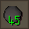
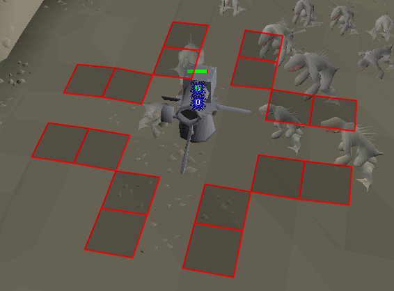
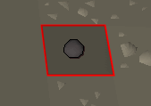

# Cannon Configuration

## Settings

### Enable cannon notifications

Sends client notifications when your cannon is low on cannonballs.

### Low Warning threshold

Controls how many cannonballs should be left before a notification is sent.

### Show cannonball infobox

Displays the amount of loaded cannonballs via an infobox.

### Show double hit spots

Displays the double hit spots next to the cannon placement.

### Double hit spots

Sets the color of the double hit spot tiles.

### Show common cannon spots

Shows optimal cannon placement locations.

