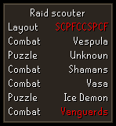

# Chambers of Xeric Plugin Configuration
### Display elapsed raid time
Displaying the elapsed raid time will result in a small infobox being shown on screen that tracks the current time spent in the raid. Hovering over it will display how long the floors have taken.


### Display points in chatbox after raid
Displaying the detailed message after a raid will result in the following message being shown:


This calculates your points participation percentage and displays the total and personal points in the chatbox.

### Show scout overlay
Showing the scout overlay will enable the use of the raids scouter that will aid you while scouting your raid.



Enabling the scout overlay outside lobby will allow you to leave the lobby (if you need to bank, for example) and have the overlay still active.

## Configuring the scouter
All these settings are not case-sensitive, and require complete room names (as shown on the overlay) to match. Adding more entries is comma separated unless stated otherwise.

### Whitelisted rooms
This will show the room names on the scout overlay in green if they match any of the whitelisted ones. 

### Blacklisted rooms
This will show any blacklisted room on  the overlay in red, so you can easily distinguish when you have a room you don't want.

### Whitelisted rotations
In order to use this, it requires its respective checkbox to be enabled.
This allows you to specify your preferred boss rotations for the scouter. Any boss rotation not whitelisted, or if there's an extra boss at the end, it will show the rooms in red (see preview image).

To add your rotations the input is as follows (example):

```
muttadiles, shamans, mystics
vespula, tekton, vasa
```

Each rotation should appear on a new line.

### Whitelisted layouts
In order to use this, it requires its respective checkbox to be enabled.
This allows you to specify certain rotations to scout for. If a layout is not matching any of the whitelisted ones, it will show up red on the overlay.

Adding entries to this list is as follows: S for scavenger, F for farming, P for Puzzle and C for combat. Example: `CFSCPPCSCF` being one layout.
