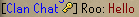
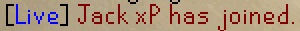

# Chat Channels Configuration

When enabled, this plugin will add the respective rank icon next to users talking in a friends chat and remove a leading slash from any messages sent in the "Clan" chat tab

## Friends Chat

### Chat Icons

Show friends chat icons next to members.

### Recent Chats

Show recent friend chats when you are not current in one.

### Show Join/Leave

Adds a temporary message when friends chat members join or leave.

### Join/Leave rank

Only show join/leave messages for members at or above the selected rank.

### Private Message Icons

Add rank icons to private messages received from friends chat members.

### Public Chat Icons

Add rank icons to public chat messages sent from friends chat members.

### Confirm Kicks

Shows a chat prompt to confirm kicks.

### Recolor ignored players

Recolor members who are on your ignore list.

### Ignored color

The color of the ignored members.

## Clan Chat / Guest Clan Chat

### Show Join/Leave

Adds a temporary message when friends chat members join or leave.

### Show Online Member Count

Shows the number of online clan members at the end of the clan's name
