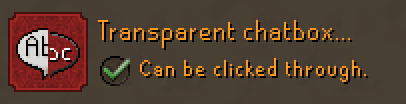
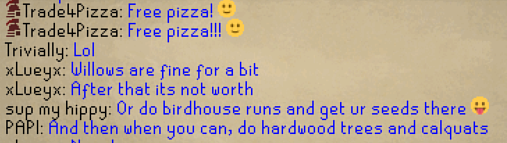
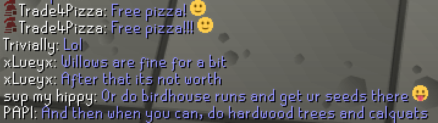

The Chat Color plugin can recolor a variety of types of chat messages, allowing you to customize the look at feel of chat.

# Chat Color Configuration

Each chat type listed below can have its color changed. If needed, you can reset each setting individually by right-clicking and selecting `Reset`, or reset all chat colors by scrolling to the bottom of the config and clicking `Reset`.

The chat type (`Opaque` or `Transparent`) is determined by the **Vanilla OSRS** setting (not RuneLite) under `Advanced Options` in the `Options` tab:

## Opaque

##### Public chat
##### Public chat highlight
##### Sent private messages
##### Sent private messages highlight
##### Received private messages
##### Received private messages highlight
##### Clan chat info
##### Clan chat info highlight
##### Clan chat message
##### Clan chat message highlight
##### Autochat
##### Autochat highlight
##### Trade chat
##### Trade chat highlight
##### Server message
##### Server message highlight
##### Game message
##### Game message highlight
##### Examine
##### Examine highlight
##### Filtered
##### Filtered highlight
##### Usernames
##### Private chat usernames
##### Clan channel name
##### Clan usernames
##### Public friend usernames

## Transparent

##### Public chat (transparent)
##### Public chat highlight (transparent)
##### Sent private messages (transparent)
##### Sent private messages highlight (transparent)
##### Received private messages (transparent)
##### Received private messages highlight (transparent)
##### Clan chat info (transparent)
##### Clan chat info highlight (transparent)
##### Clan chat message (transparent)
##### Clan chat message highlight (transparent)
##### Autochat (transparent)
##### Autochat highlight (transparent)
##### Trade chat (transparent)
##### Trade chat highlight (transparent)
##### Server message (transparent)
##### Server message highlight (transparent)
##### Game message (transparent)
##### Game message highlight (transparent)
##### Examine (transparent)
##### Examine highlight (transparent)
##### Filtered (transparent)
##### Filtered highlight (transparent)
##### Usernames (transparent)
##### Private chat usernames (transparent)
##### Clan channel name (transparent)
##### Clan usernames (transparent)
##### Public friend usernames (transparent)
