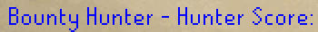

# Chat Commands Configuration

The chat commands plugin enables you to quickly access information about your account and items through chat commands.

Current commands include:

* `!price`
* `!lvl`
* `!clues`
* `!kc`
* `!qp`
* `!pb`
* `!gc` (Barbarian Assault gamble count)
* `!duels`
* `!bh` (Bounty Hunter)
* `!bhrogue` (Bounty Hunter Rogue)
* `!lms` (Last Man Standing)
* `!task`
* `!cmb`
* `!lp` (League Points)
* `!sw` (Soul Wars)
* `!pets`

# Settings

### Price Command
Enables the `!price` command.

Format: `!price [item name]`

### Level Command
Enables the `!total` and `!lvl` commands.

Format: `!lvl [skill]`, `!lvl total`, `!total`

#### Skill Abbreviations

Some skill names can be substituted for shorthand versions  
`att`, `atk` -> `Attack`  
`str` -> `Strength`  
`def` -> `Defence`  
`range`, `ranging`, `rng` -> `Ranged`  
`pray` -> `Prayer`  
`mage`, `mag` -> `Magic`  
`rc`, `rune`, `runecrafting` -> `Runecraft`  
`con`, `construct` -> `Construction`  
`hp`, `health`, `hit`, `hitpoint` -> `Hitpoints`  
`agi`, `agil` -> `Agility`  
`herb`, `hl` -> `Herblore`  
`thief` -> `Thieving`  
`craft` -> `Crafting`  
`fletch` -> `Fletching`  
`slay` -> `Slayer`  
`hunt` -> `Hunter`  
`mine` -> `Mining`  
`smith` -> `Smithing`  
`fish` -> `Fishing`  
`cook` -> `Cooking`  
`fm`, `fire` -> `Firemaking`  
`wc`, `wood`, `woodcut` -> `Woodcutting`  
`farm` -> `Farming`  
`all`, `total` -> `Overall`

### Clue Commands

Enables the `!clues` command.

Format: `!clues`- total clues, `!clues [tier]` (e.g., `!clues easy`)

### Killcount Command

Enables the `!kc` command.

Format: `!kc [boss]`, `!kc [activity]`

#### Boss Abbreviations

Some boss names can be substituted for shorthand versions:

`dusk`, `dawn`, `gargs`, `ggs`, `gg` -> `Grotesque Guardians`  
`sire` -> `Abyssal Sire`  
`cerb` -> `Cerberus`  
`smoke devil`, `thermy` -> `Thermonuclear Smoke Devil`  
`hydra` -> `Alchemical Hydra`  
`chaos ele` -> `Chaos Elemental`  
`crazy arch` -> `Crazy Archaeologist`  
`deranged arch` -> `Deranged Archaeologist`  
`vetion` -> `Vet'ion`  
`calv`, `calvarion` -> `Calvar'ion`  
`vene` -> `Venenatis`  
`kbd` -> `King Black Dragon`  
`corp` -> `Corporeal Beast`  
`kq` -> `Kalphite Queen`  
`mole` -> `Giant Mole`  
`vork` -> `Vorkath`  
`phantom`, `muspah`, `pm` -> `Phantom Muspah`  
`nm`, `tnm`, `nmare`, `the nightmare` -> `Nightmare`  
`pnm`, `phosani`, `phosanis`, `phosani nm`, `phosani nightmare`, `phosanis nightmare` -> `Phosani's Nightmare`  
`sara`, `saradomin`, `zilyana`, `zily` -> `Commander Zilyana`  
`zammy`, `zamorak`, `kril`, `kril trutsaroth` -> `K'ril Tsutsaroth`  
`arma`, `kree`, `kreearra`, `armadyl` -> `Kree'arra`  
`bando`, `bandos`, `graardor` -> `General Graardor`  
`supreme` -> `Dagannoth Supreme`  
`rex` -> `Dagannoth Rex`  
`prime` -> `Dagannoth Prime`  
`duke` -> `Duke Sucellus`  
`duke awakened`, `duke sucellus awakened` -> `Duke Sucellus (awakened)`  
`levi`, `the leviathan` -> `Leviathan`  
`levi awakened`, `leviathan awakened`, `the leviathan awakened` -> `Leviathan (awakened)`  
`vard` -> `Vardorvis`  
`vard awakened`, `vardorvis awakened` -> `Vardorvis (awakened)`  
`wisp`, `whisp`, `the whisperer` -> `Whisperer`  
`wisp awakened`, `whisp awakened`, `whisperer awakened` -> `Whisperer (awakened)`  
`barrows` -> `Barrows Chests`  
`lunar chests`, `moons of peril`, `perilous moon`, `perilous moons` -> `Lunar Chest`  
`gaunt`, `the gauntlet` -> `Gauntlet`  
`cg`, `cgaunt`, `cgauntlet`, `the corrupted gauntlet` -> `Corrupted Gauntlet`  
`jad`, `tzhaar fight cave` -> `TzTok-Jad`  
`jad 1-6` -> `TzHaar-Ket-Rak's [First-Sixth] Challenge`  
`zuk`, `inferno` -> `TzKal-Zuk`  
`sol`, `colo`, `colosseum`, `fortis colosseum` -> `Sol Heredit`  
`cox`, `xeric`, `chambers`, `olm`, `raids` -> `Chambers of Xeric`  
`cox solo`, `cox duo`, `cox [1-24]`, `cox 24+` -> `Chambers of Xeric [1-24+] players`  
`cox cm`, `xeric cm`, `chambers cm`, `olm cm`, `raids cm`, `chambers of xeric - challenge mode` -> `Chambers of Xeric: Challenge Mode`  
`cox cm solo`, `cox cm duo`, `cox cm [1-24]`, `cox cm 24+` -> `Chambers of Xeric: Challenge Mode [1-24+] players`  
`tob sm`, `tob story mode`, `tob story`, `tob entry mode`, `tob em`, `tob entry` -> `Theatre of Blood: Entry Mode`  
`tob`, `theatre`, `verzik`, `verzik vitur`, `raids 2` -> `Theatre of Blood`  
`tob solo`, `tob duo`, `tob [1-5]` -> `Theatre of Blood [1-5] players`  
`tob cm`, `tob hm`, `tob hard mode`, `tob hard`, `hmt` -> `Theatre of Blood: Hard Mode`  
`hmt solo`, `hmt duo`, `hmt [1-5]` -> `Theatre of Blood: Hard Mode [1-5] players`  
`toa entry`, `toa entry mode`, `tombs of amascut - entry` -> `Tombs of Amascut: Entry Mode`  
`toa entry solo`, `toa entry duo`, `toa entry [1-8]` -> `Tombs of Amascut: Entry Mode [1-8] players`  
`toa`, `tombs`, `amascut`, `warden`, `wardens`, `raids 3` -> `Tombs of Amascut`  
`toa solo`, `toa duo`, `toa [1-8]` -> `Tombs of Amascut [1-8] players`  
`toa expert`, `toa expert mode`, `tombs of amascut - expert` -> `Tombs of Amascut: Expert Mode`  
`toa expert solo`, `toa expert duo`, `toa expert [1-8]` -> `Tombs of Amascut: Expert Mode [1-8] players`

Note: if the chat commands for !kc do not work in-game, you first need to open up an in-game Ring of Wealth's boss kill log or the Adventure log (in your own POH), or get another kill for RuneLite to register the kill counts.

#### Agility Course Abbreviations  
`!kc` can also be used to share your Agility Course lap counts:

`gnome stronghold` -> `Gnome Stronghold Agility`  
`brimhaven`, `brimhavan agility` -> `Agility Arena`  
`shayb`, `sbac`, `shayzienbasic`, `shayzien basic` -> `Shayzien Basic Agility Course`  
`draynor`, `draynor agility` -> `Draynor Village Rooftop`  
`al kharid`, `al-kharid`, `alkharid`, `al kharid agility`, `al-kharid agility`, `alkharid agility` -> `Al Kharid Rooftop`  
`skullball` -> `Werewolf Skullball`  
`ap`, `pyramid`, -> `Agility Pyramid`  
`penguin` -> `Penguin Agility`  
`varrock`, `varrock agility` -> `Varrock Rooftop`  
`barb`, `barb outpost` -> `Barbarian Outpost`  
`canifis`, `canifis agility` -> `Canifis Rooftop`  
`aa`, `ape atoll` -> `Ape Atoll Agility`  
`shaya`, `saac`, `shayadv`, `shayadvanced`, `shayzien advanced` -> `Shayzien Advanced Agility Course`  
`fally`, `fally agility`, `falador`, `falador agility` -> `Falador Rooftop`  
`hs`,`hs[1-5]`, `hs [1-5]`, `ghc`, `sepulchre` -> `Hallowed Sepulchre`  
`wildy`, `wildy agility` -> `Wilderness Agility`  
`werewolf` ->  `Werewolf Agility`  
`seers`, `seers'`, `seer's`, `seers village`, `seers' village`, `seer's village`, `seers agility`, `seers' agility`, `seer's agility`, `seers village agility`, `seers' village agility`, `seer's village agility` -> `Seers' Village Rooftop`  
`dorg`, `dorgesh kaan`, `dorgesh-kaan` -> `Dorgesh-Kaan Agility`  
`pollnivneach`, `pollnivneach agility` -> `Pollnivneach Rooftop`  
`prif`, `prifddinas` -> `Prifddinas Agility Course`  
`rellekka`, `rellekka agility` -> `Rellekka Rooftop`  
`ardy`, `ardy agility`, `ardy rooftop`, `ardougne`, `ardougne agility` -> `Ardougne Rooftop`

#### Miscellaneous Abbreviations
For some miscellaneous activities, the following shorthand versions can be used:

`wt` -> `Wintertodt`  
`fishingtodt`, `fishtodt` -> `Tempoross`  
`gotr`, `runetodt`, `rifts closed` -> `Guardians of the Rift`   
`hunterrumour`, `hunter contract`, `hunter contracts`, `hunter tasks`, `hunter task`, `rumours`, `rumour` -> `Hunter Rumours`  
`herbi` -> `Herbiboar`  
`bird egg`, `bird eggs`, `bird's egg`, `bird's eggs` -> `Bird's egg sacrifices`

### Quest Points Commands

Enables the `!qp` command.

### Personal Best Command

Enables the `!pb` command.

Personal best times are stored for bosses and activities that keep personal best data in game. If applicable, you can pull these numbers from an Adventure Log's "Counters" section in your POH.  
For potential shorthand versions, refer to the aliases listed [above](#boss-abbreviations).

Examples include:  
`!pb zulrah`  
`!pb galvek`  
`!pb tob`  
`!pb toa expert 3`  
`!pb prif`  
`!pb hs 5`

### GC Command

Enables the `!gc` command to show Barbarian Assault High gamble count.

### Duels Command

Enables the `!duels` command.

### Bounty Hunter Command

Enables the `!bh` command.

### Bounty Hunter Rogue Command

Enables the `!bhrogue` command.

### LMS Command

Enables the `!lms` command.

### Clear Single Word

Enable hotkey to delete a single word at a time, rather than a single letter.

### Clear Chat Box

Enable hotkey to delete the entire type message in the chatbox.
