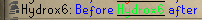
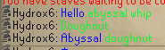

The Chat Notifications plugin can highlight and send notifications upon certain text appearing in chat messages, even from non-player chat messages.

## Settings

### Highlight own name

Highlights any instance of your username in chat

### Highlight words

Highlights a custom set of words. Entries in this field should be separated by commas. (`, `)

### Notify on own name

Notifies you whenever your name is mentioned

### Notify on highlight

Notifies you whenever a highlighted word is matched

### Notify on trade

Notifies you whenever you are traded

### Notify on duel

Notifies you whenever you are challenged to a duel

### Notify on broadcast

Notifies you whenever you receive a broadcast message (e.g., Game update message, OSRS Twitch livestream, Last Man Standing chest location).
