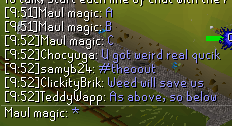

The Chat Timestamps plugin prepends a timestamp to chat messages you receive.

## Settings

### Timestamps (opaque)

Colour of Timestamps from the Timestamps plugin (opaque)

### Timestamps (transparent)

Colour of Timestamps from the Timestamps plugin (transparent)

### Timestamp Format

Customize your timestamp format by using the following characters

* `yyyy` : year
* `MM` : month
* `dd` : day
* `HH` : hour in 24 hour format
* `hh` : hour in 12 hour format
* `mm` : minute
* `ss` : second
