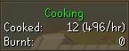
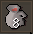

The Cooking plugin adds overlays to track your session cooking stats and to display a countdown to wine fermentation when making wines.

 

## Settings

### Reset stats (minutes)

Configures the time until the session resets and the overlay is hidden (0 = Disable feature)

### Show wine fermenting timer

Conifgures if the timer before wines are fermented is shown.
