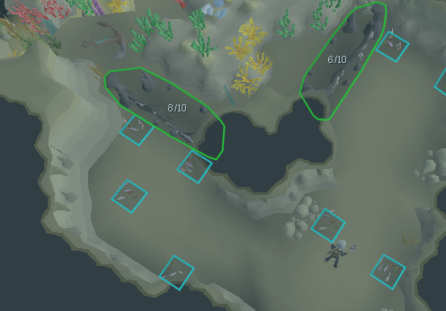

## Drift Net Configuration

Display information about drift nets

## Settings

### Show net status

Show net status and fish count

### Fish count color

Color of the fish count text

### Highlight untagged fish

Highlight the untagged fish

### Tagged timeout

Time required for a tag to expire

### Untagged fish color

Color of untagged fish

### Tag Annette when no nets in inventory

Tag Annette when no nets in inventory

### Annette tag color

Color of Annette tag
