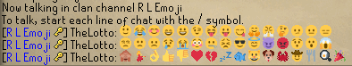

Substitutes typed emoticons to display emojis in the game chat panel and above players' heads.

# Emoji Reference

| Emoji | Trigger | Emoji | Trigger | Emoji | Trigger |
| ------------- | ------------- | ------------- | ------------- | ------------- | ------------- |
| ![slight_smile] | :) | ![joy] | =') | ![cowboy] | 3:) |
| ![blush] | ^\_^ | ![smile] | :D | ![grinning] | =D |
| ![wink] | ;) | ![stuck_out_tongue_closed_eyes] | X-P | ![stuck_out_tongue] | :P |
| ![yum] | =P~ | ![hugging] | >:D< | ![triumph] | :> |
| ![thinking] | :‑? | ![confused] | :/ | ![neutral_face] | =\| |
| ![expressionless] | :\| | ![unamused] | :-\| | ![slight_frown] | :( |
| ![frowning2] | =( | ![cry] | :'( | ![sob] | :\_(  |
| ![flushed] | :$ | ![zipper_mouth] | :-# | ![persevere] | >_< |
| ![sunglasses] | 8-) | ![innocent] | O:) | ![smiling_imp] | >:) |
| ![rage] | >:( | ![hushed] | :‑O | ![open_mouth] | :O |
| ![scream] | :-@ | ![see_no_evil] | X_X | ![dancer] | \\:D/ |
| ![ok_hand] | (Ok) | ![thumbsup] | (Y) | ![thumbsdown] | (N) |
| ![hearts] | <3 | ![broken_heart] | </3 | ![zzz] | Zzz |
| ![fish] | <>< | ![cat] | :3 | ![dog] | =3 |
| ![crab] | V(;,;)V | ![fork_and_knife] | --E | ![cooking] | --(o) |
| ![party_popper] | @@@ | ![sweat] | ;; | ![eyes] | O.O |
| ![pile_of_poo] | \~@\~ | ![fire] |(/\\) | ![alien] | (@.@) |
| ![eggplant] | 8=D | ![wave] | (^_^)/ | ![heart_eyes] | (\*.\*) |
| ![facepalm] | M-) |![pensive] | V_V | ![acorn] | <D~ | 
| ![gorilla] | :G | ![pleading] | (n_n) | ![xd] | Xd |
| ![spoon] | --o | ![weary_face] | Dx | ![rocketship] | >==> |
| ![clown] | :O) | ![cow] | 3:O |||

[slight_smile]:https://github.com/runelite/runelite/raw/master/runelite-client/src/main/resources/net/runelite/client/plugins/emojis/slight_smile.png "Slight Smile"
[joy]:https://github.com/runelite/runelite/raw/master/runelite-client/src/main/resources/net/runelite/client/plugins/emojis/joy.png "Joy"
[cowboy]:https://github.com/runelite/runelite/raw/master/runelite-client/src/main/resources/net/runelite/client/plugins/emojis/cowboy.png "Cowboy"
[blush]:https://github.com/runelite/runelite/raw/master/runelite-client/src/main/resources/net/runelite/client/plugins/emojis/blush.png "Blushing"
[smile]:https://github.com/runelite/runelite/raw/master/runelite-client/src/main/resources/net/runelite/client/plugins/emojis/smile.png "Smiling"
[grinning]:https://github.com/runelite/runelite/raw/master/runelite-client/src/main/resources/net/runelite/client/plugins/emojis/grinning.png "Grinning"
[wink]:https://github.com/runelite/runelite/raw/master/runelite-client/src/main/resources/net/runelite/client/plugins/emojis/wink.png "Winking"
[stuck_out_tongue_closed_eyes]:https://github.com/runelite/runelite/raw/master/runelite-client/src/main/resources/net/runelite/client/plugins/emojis/stuck_out_tongue_closed_eyes.png "Stuck-out Tongue (Closed Eyes)"
[stuck_out_tongue]:https://github.com/runelite/runelite/raw/master/runelite-client/src/main/resources/net/runelite/client/plugins/emojis/stuck_out_tongue.png "Stuck-out Tongue"
[yum]:https://github.com/runelite/runelite/raw/master/runelite-client/src/main/resources/net/runelite/client/plugins/emojis/yum.png "Yum"
[hugging]:https://github.com/runelite/runelite/raw/master/runelite-client/src/main/resources/net/runelite/client/plugins/emojis/hugging.png "Hugging"
[triumph]:https://github.com/runelite/runelite/raw/master/runelite-client/src/main/resources/net/runelite/client/plugins/emojis/triumph.png "Triumphant"
[thinking]:https://github.com/runelite/runelite/raw/master/runelite-client/src/main/resources/net/runelite/client/plugins/emojis/thinking.png "Thinking"
[confused]:https://github.com/runelite/runelite/raw/master/runelite-client/src/main/resources/net/runelite/client/plugins/emojis/confused.png "Confused"
[neutral_face]:https://github.com/runelite/runelite/raw/master/runelite-client/src/main/resources/net/runelite/client/plugins/emojis/neutral_face.png "Neutral Face"
[expressionless]:https://github.com/runelite/runelite/raw/master/runelite-client/src/main/resources/net/runelite/client/plugins/emojis/expressionless.png "Expressionless"
[unamused]:https://github.com/runelite/runelite/raw/master/runelite-client/src/main/resources/net/runelite/client/plugins/emojis/unamused.png "Unamused"
[slight_frown]:https://github.com/runelite/runelite/raw/master/runelite-client/src/main/resources/net/runelite/client/plugins/emojis/slight_frown.png "Slight Frown"
[frowning2]:https://github.com/runelite/runelite/raw/master/runelite-client/src/main/resources/net/runelite/client/plugins/emojis/frowning2.png "Frowning"
[cry]:https://github.com/runelite/runelite/raw/master/runelite-client/src/main/resources/net/runelite/client/plugins/emojis/cry.png "Crying"
[sob]:https://github.com/runelite/runelite/raw/master/runelite-client/src/main/resources/net/runelite/client/plugins/emojis/sob.png "Sobbing"
[flushed]:https://github.com/runelite/runelite/raw/master/runelite-client/src/main/resources/net/runelite/client/plugins/emojis/flushed.png "Flushed"
[zipper_mouth]:https://github.com/runelite/runelite/raw/master/runelite-client/src/main/resources/net/runelite/client/plugins/emojis/zipper_mouth.png "Zipper Mouth"
[persevere]:https://github.com/runelite/runelite/raw/master/runelite-client/src/main/resources/net/runelite/client/plugins/emojis/persevere.png "Persevering"
[sunglasses]:https://github.com/runelite/runelite/raw/master/runelite-client/src/main/resources/net/runelite/client/plugins/emojis/sunglasses.png "Sunglasses"
[innocent]:https://github.com/runelite/runelite/raw/master/runelite-client/src/main/resources/net/runelite/client/plugins/emojis/innocent.png "Innocent"
[smiling_imp]:https://github.com/runelite/runelite/raw/master/runelite-client/src/main/resources/net/runelite/client/plugins/emojis/smiling_imp.png "Smiling Imp"
[rage]:https://github.com/runelite/runelite/raw/master/runelite-client/src/main/resources/net/runelite/client/plugins/emojis/rage.png "Raging"
[hushed]:https://github.com/runelite/runelite/raw/master/runelite-client/src/main/resources/net/runelite/client/plugins/emojis/hushed.png "Hushed"
[open_mouth]:https://github.com/runelite/runelite/raw/master/runelite-client/src/main/resources/net/runelite/client/plugins/emojis/open_mouth.png "Open Mouth"
[scream]:https://github.com/runelite/runelite/raw/master/runelite-client/src/main/resources/net/runelite/client/plugins/emojis/scream.png "Screaming"
[see_no_evil]:https://github.com/runelite/runelite/raw/master/runelite-client/src/main/resources/net/runelite/client/plugins/emojis/see_no_evil.png "See No Evil"
[dancer]:https://github.com/runelite/runelite/raw/master/runelite-client/src/main/resources/net/runelite/client/plugins/emojis/dancer.png "Dancer"
[ok_hand]:https://github.com/runelite/runelite/raw/master/runelite-client/src/main/resources/net/runelite/client/plugins/emojis/ok_hand.png "Ok Hand"
[thumbsup]:https://github.com/runelite/runelite/raw/master/runelite-client/src/main/resources/net/runelite/client/plugins/emojis/thumbsup.png "Thumbs Up"
[thumbsdown]:https://github.com/runelite/runelite/raw/master/runelite-client/src/main/resources/net/runelite/client/plugins/emojis/thumbsdown.png "Thumbs Down"
[hearts]:https://github.com/runelite/runelite/raw/master/runelite-client/src/main/resources/net/runelite/client/plugins/emojis/hearts.png "Heart"
[broken_heart]:https://github.com/runelite/runelite/raw/master/runelite-client/src/main/resources/net/runelite/client/plugins/emojis/broken_heart.png "Broken Heart"
[zzz]:https://github.com/runelite/runelite/raw/master/runelite-client/src/main/resources/net/runelite/client/plugins/emojis/zzz.png "ZZZ"
[fish]:https://github.com/runelite/runelite/raw/master/runelite-client/src/main/resources/net/runelite/client/plugins/emojis/fish.png "Fish"
[cat]:https://github.com/runelite/runelite/raw/master/runelite-client/src/main/resources/net/runelite/client/plugins/emojis/cat.png "Cat"
[dog]:https://github.com/runelite/runelite/raw/master/runelite-client/src/main/resources/net/runelite/client/plugins/emojis/dog.png "Dog"
[crab]:https://github.com/runelite/runelite/raw/master/runelite-client/src/main/resources/net/runelite/client/plugins/emojis/crab.png "Crab ($11)"
[fork_and_knife]:https://github.com/runelite/runelite/raw/master/runelite-client/src/main/resources/net/runelite/client/plugins/emojis/fork_and_knife.png "Fork & Knife"
[cooking]:https://github.com/runelite/runelite/raw/master/runelite-client/src/main/resources/net/runelite/client/plugins/emojis/cooking.png "Cooking"
[party_popper]:https://github.com/runelite/runelite/raw/master/runelite-client/src/main/resources/net/runelite/client/plugins/emojis/party_popper.png "Party Popper"
[sweat]:https://github.com/runelite/runelite/raw/master/runelite-client/src/main/resources/net/runelite/client/plugins/emojis/sweat.png "Sweat"
[eyes]:https://github.com/runelite/runelite/raw/master/runelite-client/src/main/resources/net/runelite/client/plugins/emojis/eyes.png "Eyes"
[pile_of_poo]:https://github.com/runelite/runelite/raw/master/runelite-client/src/main/resources/net/runelite/client/plugins/emojis/pile_of_poo.png "Poop"
[fire]:https://github.com/runelite/runelite/raw/master/runelite-client/src/main/resources/net/runelite/client/plugins/emojis/fire.png "Fire"
[alien]:https://github.com/runelite/runelite/raw/master/runelite-client/src/main/resources/net/runelite/client/plugins/emojis/alien.png "Alien"
[eggplant]:https://github.com/runelite/runelite/raw/master/runelite-client/src/main/resources/net/runelite/client/plugins/emojis/eggplant.png "Eggplant"
[wave]:https://github.com/runelite/runelite/raw/master/runelite-client/src/main/resources/net/runelite/client/plugins/emojis/wave.png "Waving"
[heart_eyes]:https://github.com/runelite/runelite/raw/master/runelite-client/src/main/resources/net/runelite/client/plugins/emojis/heart_eyes.png "Heart Eyes"
[facepalm]:https://github.com/runelite/runelite/raw/master/runelite-client/src/main/resources/net/runelite/client/plugins/emojis/facepalm.png "Facepalm"
[pensive]:https://github.com/runelite/runelite/raw/master/runelite-client/src/main/resources/net/runelite/client/plugins/emojis/pensive.png "Pensive"
[acorn]:https://github.com/runelite/runelite/raw/master/runelite-client/src/main/resources/net/runelite/client/plugins/emojis/acorn.png "Acorn"
[gorilla]:https://github.com/runelite/runelite/raw/master/runelite-client/src/main/resources/net/runelite/client/plugins/emojis/gorilla.png "Gorilla"
[pleading]:https://github.com/runelite/runelite/raw/master/runelite-client/src/main/resources/net/runelite/client/plugins/emojis/pleading.png "Pleading"
[xd]:https://github.com/runelite/runelite/raw/master/runelite-client/src/main/resources/net/runelite/client/plugins/emojis/xd.png "Smiling Face (Open Mouth, Closed Eyes)"
[spoon]:https://github.com/runelite/runelite/raw/master/runelite-client/src/main/resources/net/runelite/client/plugins/emojis/spoon.png "Spoon"
[weary_face]:https://github.com/runelite/runelite/raw/master/runelite-client/src/main/resources/net/runelite/client/plugins/emojis/weary_face.png "Weary Face"
[rocketship]:https://github.com/runelite/runelite/raw/master/runelite-client/src/main/resources/net/runelite/client/plugins/emojis/rocketship.png "Rocketship"
[clown]:https://github.com/runelite/runelite/raw/master/runelite-client/src/main/resources/net/runelite/client/plugins/emojis/clown.png "Clown"
[cow]:https://github.com/runelite/runelite/raw/master/runelite-client/src/main/resources/net/runelite/client/plugins/emojis/cow.png "Cow"
