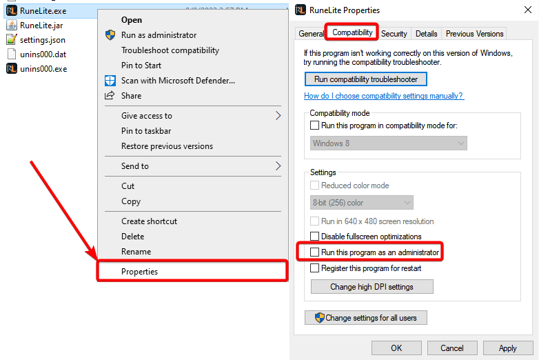
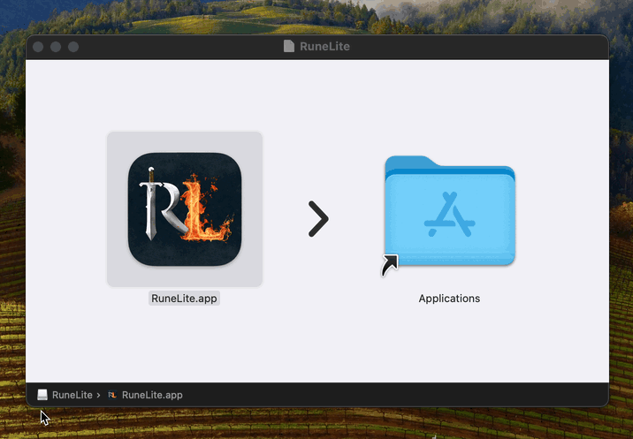
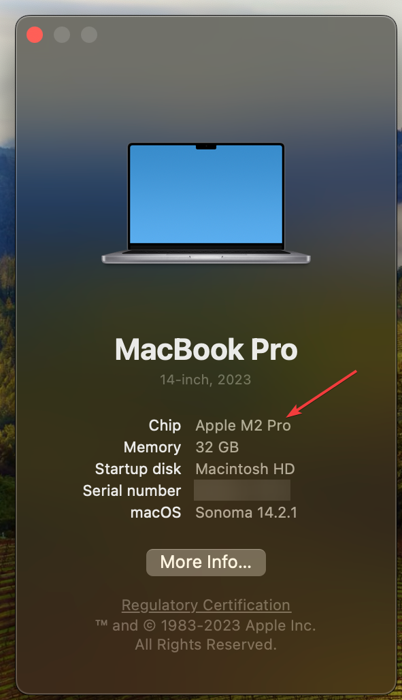

# Table of Contents
- [Table of Contents](#table-of-contents)
  - [Common Bugs](#common-bugs)
  - [How do I run RuneLite in Safe Mode?](#how-do-i-run-runelite-in-safe-mode)
  - [Feature Requests](#feature-requests)
  - [How do I enable XP drops and zoom unlimiter?](#how-do-i-enable-xp-drops-and-zoom-unlimiter)
  - [How do I use inventory tags?](#how-do-i-use-inventory-tags)
  - [How can I configure shift click or swap menu entries?](#how-can-i-configure-shift-click-or-swap-menu-entries)
  - [What is open source?](#what-is-open-source)
  - [Will using RuneLite get me banned?](#will-using-runelite-get-me-banned)
  - [How often is RuneLite updated?](#how-often-is-runelite-updated)
  - [Where can I find the logs, screenshots, or configurations?](#where-can-i-find-the-logs-screenshots-or-configurations)
  - [How can I change where screenshots get saved?](#how-can-i-change-where-screenshots-get-saved)
  - [How do I build RuneLite?](#how-do-i-build-runelite)
  - [Will there be a Runelite mobile client?](#will-there-be-a-runelite-mobile-client)
  - [Why does the GPU plugin do X?](#why-does-the-gpu-plugin-do-x)
  - [Linux AppImage](#linux-appimage)
  - [I want to run RuneLite from a USB drive](#i-want-to-run-runelite-from-a-usb-drive)
  - [I get the error: "This program can only be installed on versions of Windows designed for the following processor architectures"](#i-get-the-error-this-program-can-only-be-installed-on-versions-of-windows-designed-for-the-following-processor-architectures)
  - [How do I convert the previous multi session/setting file to a profile?](#how-do-i-convert-the-previous-multi-sessionsetting-file-to-a-profile)
  - [My plugins are gone or my config profile is missing](#my-plugins-are-gone-or-my-config-profile-is-missing)
  - [My Loot Tracker data is gone](#my-loot-tracker-data-is-gone)
  - [I want to transfer my settings to another computer](#i-want-to-transfer-my-settings-to-another-computer)
  - [Wrong username and password after starting via the Jagex Launcher](#wrong-username-and-password-after-starting-via-the-jagex-launcher-on-windows)
  - [The Jagex launcher is stuck on Install on macOS](#the-jagex-launcher-is-stuck-on-install-on-macos)
  - [I get the error: "You can't open the application "RuneLite" because this application is not supported on this Mac."](#i-get-the-error-you-cant-open-the-application-runelite-because-this-application-is-not-supported-on-this-mac)
  - [RuneLite is making me disconnect!](#runelite-is-making-me-disconnect)
  - [RuneLite is making my computer crash!](#runelite-is-making-my-computer-crash)


## Common Bugs
The majority of the bug reports we receive are with third party plugins from the plugin hub, and not RuneLite bugs. Plugins from the plugin hub
are not supported by RuneLite.

If you are unsure if your bug is caused by a third party plugin or not, run the client in *safe mode* and try to reproduce the issue. Safe mode disables
all plugin hub plugins, and also GPU mode.

You can run in safe mode by either running the `RuneLite (safe mode)` shortcut on Windows (available in launcher 2.6.3), or passing `--safe-mode` to the RuneLite executable. For more information, see [below](#how-do-i-run-runelite-in-safe-mode).

## How do I run RuneLite in Safe Mode?

### Without a Jagex account:

Windows: Run the `RuneLite (safe mode)` shortcut in your Windows Start menu.

Mac: In Terminal, run:
`/Applications/RuneLite.app/Contents/MacOS/RuneLite --safe-mode`

### With a Jagex account:

Windows: Run the `RuneLite (configure)` shortcut in your Windows Start menu.

Mac: In Terminal, run:
`/Applications/RuneLite.app/Contents/MacOS/RuneLite --configure`

Both platforms: A configuration window will pop up. Check the "Safe mode" box, then click Save. Launch RuneLite from the Jagex Launcher.

### Still not working?

Update RuneLite via [the official website](https://runelite.net/), then try again. Your configuration will not be lost.

## Feature Requests
Feature requests and ideas are taken on [GitHub discussions](https://github.com/runelite/runelite/discussions).

## How do I enable XP drops and zoom unlimiter?
We use the game's xp drops and zoom system, so enable those in the game. The zoom unlimiter plugin works by unlimiting the game's zoom feature.  
See [[XP Drop]] and [[Camera]].

## How do I use inventory tags?
See [[Inventory Tags]].

## How can I configure shift click or swap menu entries?
See [[Menu Entry Swapper]].

## What is open source?
RuneLite being open source means that the code can be inspected by anybody.  
Changes to our software, that anyone can submit, are passed through an audit and acceptance process, where we make sure that the changes don't contain any malicious or rule-breaking code. This makes sure that you won't be running such code.

## Will using RuneLite get me banned?
No. RuneLite is officially approved by Jagex, and Jagex does not ban for it. Be careful of unofficial clients claiming to be "RuneLite" that are not from us.

## How often is RuneLite updated?
RuneLite is updated every couple weeks, usually immediately following the Wednesday game update. Sometimes after large game updates, RuneLite will be outdated for a period time. Usually this is 30 mins - 1 hour.

## Where can I find the logs, screenshots, or configurations?
To find logs, either open screenshot directory (by right-clicking "Camera" button) and navigate 1 directory up and then open logs folder, or navigate to `%userprofile%\.runelite\logs` on Windows or `$HOME/.runelite/logs` on Linux and macOS.

## How can I change where screenshots get saved?
It's not possible to directly change where RuneLite saves screenshots. However, you can create a symlink between the screenshots folder and where you actually want them saved.

### On Windows:
- Move your screenshots folder to where you want to have your screenshots saved, and then delete the `screenshots` folder that's in your `.runelite` folder.
- Run Command Prompt as administrator and then run:

`mklink /J "%userprofile%\.runelite\screenshots" "path\to\new\folder"`

### On Mac/Linux:
In the terminal, run `mv $HOME/.runelite/screenshots/ /path/to/new/folder && ln -s /path/to/new/folder $HOME/.runelite/screenshots`

## How do I build RuneLite?
See [[Building with IntelliJ IDEA]].

## Will there be a Runelite mobile client?
No. [See this](https://twitter.com/RuneLiteClient/status/1057301530569777154).

## Why does the GPU plugin do X?
See [[GPU FAQ]].

## Linux AppImage
The Linux AppImage contains a bundled up combination of Java and RuneLite, that has been established to work well together. It is preferred to running a native Java installation. The AppImage allows most Linux systems, including ChromeOS devices running the Linux Beta/Crostini to play RuneLite.

We currently offer AppImages for x86_64 and aarch64 architectures. Run `uname -p` to see which architecture you have. 

Running the following script in a terminal should be enough to download RuneLite and set up the AppImage to appear in your start menu or application trays, from where it should work like any other app.
```
bash -- << EOF
mkdir -p ~/.icons ~/.local/share/applications
curl -L -o ~/.local/RuneLite.AppImage https://github.com/runelite/launcher/releases/download/2.6.3/RuneLite.AppImage
# OR use this for aarch64 systems
#curl -L -o ~/.local/RuneLite.AppImage https://github.com/runelite/launcher/releases/download/2.6.3/RuneLite-aarch64.AppImage
chmod +x ~/.local/RuneLite.AppImage
curl -L -o ~/.icons/RuneLite.png https://raw.githubusercontent.com/runelite/launcher/master/appimage/runelite.png
echo "\
[Desktop Entry]
Name=RuneLite
Comment=An opensource third party client for Old School RuneScape
Exec=$HOME/.local/RuneLite.AppImage
Terminal=false
Type=Application
Icon=RuneLite.png
Categories=Game;
" > ~/.local/share/applications/RuneLite.desktop
EOF
```

If your system is aarch64 architecture, you will need to additionally install `zlib1g-dev` due to an appimage [bug](https://github.com/AppImage/AppImageKit/issues/964).

## I want to run RuneLite from a USB drive

* Download the latest AdoptOpenJDK JRE version 11 from https://adoptopenjdk.net/ and unzip it onto the drive.
* Download the latest all-platforms jar launcher from https://runelite.net onto the drive.
* Make a .bat file which includes `java -Duser.home=client-home -Djava.io.tmpdir=client-tmp -jar RuneLite.jar --launch-mode=REFLECT`. You will probably have to replace `java` with the full path to `java.exe` that was unzipped on the drive.

Now run the .bat file to launch the client.

## I get the error: "This program can only be installed on versions of Windows designed for the following processor architectures"

Make sure you are downloading the correct launcher for your operating system architecture. If you have an ARM64 laptop you need to select the `Download for Windows (ARM64)` option from the dropdown.

## How do I convert the previous multi session/setting file to a profile?

On the side panel navigate to the profile section, and select Import Profile.


Navigate to .runelite (Easy way is to click the HOME icon then go into your windows name and then click into .runelite).


If you used to use `--config=<filename>` ex. `--config=iron.properties`, use that file as your import, make sure the profile is named correctly (as seen in first screenshot) with the rename profile button.

If you are signed in to a RL account, or used to use the new deprecated `--session` parameter to sign in to one automatically, to sync settings; the settings for the account will be found in `.runelite\profiles\<email>` and you will need to import each one from each email.  Then only ever sign in to a single RL account that holds every profile.

If you want the client to load a specific profile on startup use `--profile=<profilename>` ex. `--profile=iron` like below


## My plugins are gone or my config profile is missing

1. Make sure you are signed in to the correct RuneLite account if you use one.<br>
Open the info panel and check if this displays the correct email. The info panel can be enabled via `Configuration` (wrench icon) > `Info panel`. It will be located in the sidebar.<br>


2. Make sure you are on the correct RuneLite config profile.<br>
Go to `Configuration` (wrench icon) > `Profiles` (middle tab) > Check if any of the profiles are correct. You can load a profile by clicking on the `>` symbol **twice**. A profile is enabled if there is an orange bar in front of it.<br>


Please try all config profiles. If you find the correct config profile and it shares a name with a different profile, it is recommended to rename the correct one to a unique name.

3. If you were previously using `--config=` or `--session` parameters/clientargs, switch to only using `--profile=profilenamehere`. Please refer to [How do I convert the previous multi session/setting file to a profile?](#how-do-i-convert-the-previous-multi-sessionsetting-file-to-a-profile) for more info.

4. Reimport your profile.<br>
Go to the previously mentioned `Profiles` tab and click on the `Import Profile` button. You can find your profiles in `.runelite/profiles2/`. You can find older legacy (pre Feb 18th 2023) profiles either in `.runelite/profiles/<email>` or if you were previously not signed in to RL in `.runelite/`. Please refer to [How do I convert the previous multi session/setting file to a profile?](#how-do-i-convert-the-previous-multi-sessionsetting-file-to-a-profile) for more info.

5. If your config profile is still missing, join the [RuneLite Discord](https://runelite.net/discord) for further assistance.

## My Loot Tracker data is gone

Loot Tracker data is stored in your RSProfile, not in your RuneLite config profile.
1. Make sure you are logged in to the correct **OSRS account**. You have to be logged in for Loot Tracker data to show!

2. If you have not killed the specific Npc in a long time, get one kill and restart your client. Loot Tracker only loads so many entries on startup, refreshing the last time a loot was received from one can make it show up again in the client.

3. Remove duplicate RSProfiles.<br>
**Close RuneLite**. Go to https://runelite.net/account/home and check for duplicate RuneScape Profiles. Please note that it is normal to have multiple profiles with the same name if they have e.g. a `Deadman` or `Pvp arena` tag.<br>
Check the content of the duplicate RSProfiles and delete the incorrect one. Reopen RuneLite after deleting the incorrect RSProfile on the website.<br>


*In this example one of the upper 2 RSProfiles is incorrect and should be deleted.*<br>
If you can reliably reproduce duplication of RSProfiles or if you know the cause, please report it.

4. If there are no duplicate RSProfiles, check if you are signed in to the same RuneLite account on the website as in the client. To find out what RuneLite account you are logged into in the client, please refer to step 1 of [My plugins are gone or my config profile is missing](#my-plugins-are-gone-or-my-config-profile-is-missing).

5. You could try to restart the client and relog on the website a couple of times, which sometimes makes duplicate RSProfiles visible.
If your issue has not been resolved at this point, join the [RuneLite Discord](https://runelite.net/discord) for further assistance.

## I want to transfer my settings to another computer
You can either copy the whole `.runelite` folder to the other computer, or you can sync your profile. If you are setting up a new computer, you should copy `.runelite` instead of doing a profile sync because copying `.runelite` will also include screenshots and other 3rd party plugin settings which wouldn't be included in a profile sync.

- `.runelite` is located in `%userprofile%` on **Windows** (eg `c:\Users\your name`) or `$HOME` on **Linux** and **macOS**. Be sure to close RuneLite on the system you are copying `.runelite` to prior to copying the files.
- To sync your profile, go to `Configuration` (wrench icon) > `Profiles` (middle tab). Select the profile you want to sync and click on the cloud icon (`Enable cloud sync`). If the icon is orange, then cloud sync is enabled. You could try to disable and re-enable cloud sync if it does not sync properly.<br>


# Wrong username and password after starting via the Jagex Launcher on Windows
After you've migrated to a Jagex account, you are no longer required to type your username and password in to login. If you are still prompted for this info, it's very likely your RuneLite is running as admin, which breaks 1-click login.  
You can fix this by un-checking the `Run this program as an administrator` box in Windows Properties settings.


## The Jagex launcher is stuck on Install on macOS
Unlike on Windows where the Jagex launcher can check where your RuneLite is installed, on macOS it expects RuneLite to be in the applications folder. Moving it to the applications folder will resolve your issue.


## I get the error: "You can't open the application "RuneLite" because this application is not supported on this Mac."

This error appears when you've downloaded the wrong version of RuneLite for your mac. You can open the `About this Mac` prompt and see what `Chip` your Mac uses.  
If it's `Intel` select `Download for macOS (Intel)`, if it's `Apple` select `Download for macOS (Apple)`


## RuneLite is making me disconnect!

RuneLite can't make you disconnect. There are rare circumstances where the traffic generated from RuneLite (particularly the ICMP echos used by the world hopper plugin), or the normal RuneScape game traffic, can trigger devices on your network to terminate the connection or crash. This is uncommon, and it is much more likely your internet is not working correctly.

RuneScape relies on a single TCP connection to the game servers for game play. This works very different from other web applications and streaming services you might be used to, and so it is possible to have a degraded network (such as one with packet loss) that appears to behave okay on other applications. Check if you have packet loss, preferably to the game server you are trying to play on, by using `ping`.

## RuneLite is making my computer crash!

RuneLite can't make your computer crash. Modern operating systems, which your computer will be using, use memory protection, which prevents applications from accessing and writing to memory belonging to both other applications and the kernel itself.

Instead, what could be happening may be (but not exclusive to):

Your GPU drivers are crashing, possibly causing your displays to go black.
The kernel is crashing.
Your hardware is broken.

If you are using Windows, use the Windows Event Viewer to get insight into what is crashing.
