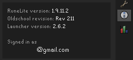
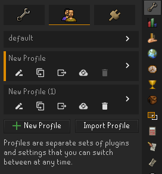
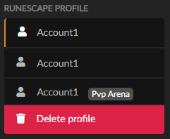
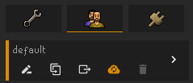

# Table of Contents
- [Table of Contents](#table-of-contents)
  - [Common Bugs](#common-bugs)
  - [Feature Requests](#feature-requests)
  - [How do I enable XP drops and zoom unlimiter?](#how-do-i-enable-xp-drops-and-zoom-unlimiter)
  - [How do I use inventory tags?](#how-do-i-use-inventory-tags)
  - [How can I configure shift click or swap menu entries?](#how-can-i-configure-shift-click-or-swap-menu-entries)
  - [What is open source?](#what-is-open-source)
  - [Will using RuneLite get me banned?](#will-using-runelite-get-me-banned)
  - [How often is RuneLite updated?](#how-often-is-runelite-updated)
  - [Where can I find the logs, screenshots, or configurations?](#where-can-i-find-the-logs-screenshots-or-configurations)
  - [How do I build RuneLite?](#how-do-i-build-runelite)
  - [Will there be a Runelite mobile client?](#will-there-be-a-runelite-mobile-client)
  - [Why does the GPU plugin do X?](#why-does-the-gpu-plugin-do-x)
  - [Linux AppImage](#linux-appimage)
  - [I want to run RuneLite from a USB drive](#i-want-to-run-runelite-from-a-usb-drive)
  - [I get the error: "This program can only be installed on versions of Windows designed for the following processor architectures"](#i-get-the-error-this-program-can-only-be-installed-on-versions-of-windows-designed-for-the-following-processor-architectures)
  - [How do I convert the previous multi session/setting file to a profile?](#how-do-i-convert-the-previous-multi-sessionsetting-file-to-a-profile)
  - [My plugins are gone or my config profile is missing](#my-plugins-are-gone-or-my-config-profile-is-missing)
  - [My Loot Tracker data is gone](#my-loot-tracker-data-is-gone)
  - [I want to transfer my settings to another computer](#i-want-to-transfer-my-settings-to-another-computer)


## Common Bugs
See [[Troubleshooting problems with the client]]

## Feature Requests
See [[Rejected or Rolled Back Features]]

## How do I enable XP drops and zoom unlimiter?
We use the game's xp drops and zoom system, so enable those in the game. The zoom unlimiter plugin works by unlimiting the game's zoom feature.  
See [[XP Drop]] and [[Camera Zoom]]

## How do I use inventory tags?
See [[Inventory Tags]]

## How can I configure shift click or swap menu entries?
See [[Menu Entry Swapper]]

## What is open source?
RuneLite being open source means that the code can be inspected by anybody.  
Changes to our software, that anyone can submit, are passed through an audit and acceptance process, where we make sure that the changes don't contain any malicious or rule-breaking code. This makes sure that you won't be running such code.

## Will using RuneLite get me banned?
No. However, you must be using the official RuneLite client. Be careful of unofficial and malicious clients.  
Jagex stance on 3rd party clients: https://clips.twitch.tv/AbnegateAbstemiousDogeDatBoi  
Jagex official statement: http://services.runescape.com/m=news/third-party-client-update?oldschool=1  

## How often is RuneLite updated?
If you're using the launcher, count on seeing updates every week on Thursday. These Thursday releases are done after the game has updated, and can take a few hours if there has been an engine change in the game.

## Where can I find the logs, screenshots, or configurations?
To find logs, either open screenshot directory (by right-clicking "Camera" button) and navigate 1 directory up and then open logs folder, or navigate to `%userprofile%\.runelite\logs` on Windows or `$HOME/.runelite/logs` on Linux and macOS.

## How do I build RuneLite?
See [[Building with IntelliJ IDEA]].

## Will there be a Runelite mobile client?
No. [See this.](https://twitter.com/RuneLiteClient/status/1057301530569777154)

## Why does the GPU plugin do X?
See [[GPU FAQ]].

## Linux AppImage
The Linux AppImage contains a bundled up combination of Java and RuneLite, that has been established to work well together. It is preferred to running a native Java installation. The AppImage allows most Linux systems, including ChromeOS devices running the Linux Beta/Crostini to play RuneLite.

We currently offer AppImages for x86_64 and aarch64 architectures. Run `uname -p` to see which architecture you have. 

Running the following script in a terminal should be enough to download RuneLite and set up the AppImage to appear in your start menu or application trays, from where it should work like any other app.
```
bash -- << EOF
mkdir -p ~/.icons ~/.local/share/applications
curl -L -o ~/.local/RuneLite.AppImage https://github.com/runelite/launcher/releases/download/2.6.1/RuneLite.AppImage
# OR use this for aarch64 systems
#curl -L -o ~/.local/RuneLite.AppImage https://github.com/runelite/launcher/releases/download/2.6.1/RuneLite-aarch64.AppImage
chmod +x ~/.local/RuneLite.AppImage
curl -L -o ~/.icons/RuneLite.png https://raw.githubusercontent.com/runelite/launcher/master/appimage/runelite.png
echo "\
[Desktop Entry]
Name=RuneLite
Comment=An opensource third party client for Old School RuneScape
Exec=$HOME/.local/RuneLite.AppImage
Terminal=false
Type=Application
Icon=RuneLite.png
Categories=Game;
" > ~/.local/share/applications/RuneLite.desktop
EOF
```

If your system is aarch64 architecture, you will need to additionally install `zlib1g-dev` due to an appimage [bug](https://github.com/AppImage/AppImageKit/issues/964)

## I want to run RuneLite from a USB drive

* Download the latest AdoptOpenJDK JRE version 11 from https://adoptopenjdk.net/ and unzip it onto the drive
* Download the latest all-platforms jar launcher from https://runelite.net onto the drive
* Make a .bat file which includes `java -Duser.home=client-home -Djava.io.tmpdir=client-tmp -jar RuneLite.jar --launch-mode=REFLECT`. You will probably have to replace `java` with the full path to `java.exe` that was unzipped on the drive.

Now run the .bat file to launch the client.

## I get the error: "This program can only be installed on versions of Windows designed for the following processor architectures"

If you have an ARM laptop running Windows, you need to install Microsoft OpenJDK from https://github.com/microsoft/openjdk-aarch64/releases/download/jdk-11.0.12-ga/microsoft-jdk-11.0.12.7.1-windows-aarch64.msi and then download and run the `All Platforms` version of RuneLite from https://runelite.net. This also requires the Microsoft Visual C++ Redistributables be installed, which if you do not already have, can be downloaded from https://aka.ms/vs/17/release/vc_redist.arm64.exe

## How do I convert the previous multi session/setting file to a profile?

On the side panel navigate to the profile section, and select Import Profile


Navigate to .runelite (Easy way is to click the HOME icon then go into your windows name and then click into .runelite)


If you used to use `--config=<filename>` ex. `--config=iron.properties`, use that file as your import, make sure the profile is named correctly (as seen in first screen shot) with the rename profile button.

If you are signed in to a RL account, or used to use the new depricated `--session` parameter to sign in to one automatically, to sync settings; the settings for the account will be found in `.runelite\profiles\<email>` and you will need to import each one from each email.  Then only ever sign in to a single RL account that holds every profile.

If you want the client to load a specific profile on startup use `--profile=<profilename>` ex. `--profile=iron` like below


## My plugins are gone or my config profile is missing

1. Make sure you are logged into the correct RuneLite account if you are usually signed in.<br>
Open the info panel and check if this displays the correct Gmail account. The info panel can be enabled via `Configuration` (wrench icon) > `Info panel`. It will be located in the sidebar.<br>


2. Make sure you are on the correct RuneLite config profile.<br>
Go to `Configuration` (wrench icon) > `Profiles` (middle tab) > Check if any of the profiles are correct. You can load a profile by clicking on the `>` symbol **twice**. A profile is enabled if there is an orange bar in front of it.<br>
<br>
Please try all config profiles. If you find the correct config profile and it shares a name with a different profile, it is recommended to rename the correct one to a unique name.

3. Reimport your profile.<br>
Go to the previously mentioned `Profiles` tab and click on the `Import Profile` button. You can find your profiles in `.runelite/profiles2/`. You can find older profiles either in `.runelite/profiles/emailhere@gmail.com` or if you were previously not signed in to RL in `.runelite/`. Please refer to [How do I convert the previous multi session/setting file to a profile?](#how-do-i-convert-the-previous-multi-sessionsetting-file-to-a-profile) for more info.

4. If you were previously using `--config=` or `--session` parameters/clientargs, switch to only using `--profile=profilenamehere`. Please refer to [How do I convert the previous multi session/setting file to a profile?](#how-do-i-convert-the-previous-multi-sessionsetting-file-to-a-profile) for more info.

5. If your config profile is still missing, you can post in #support in the RuneLite Discord for further assistance. Please post a screenshot of your `Profiles` tab and post your `client.log` (drag and drop the file onto Discord). Navigate to `%userprofile%\.runelite\logs` on **Windows** or `$HOME/.runelite/logs` on **Linux** and **macOS**.

## My Loot Tracker data is gone

Loot Tracker data is stored in your RSProfile, not in your RuneLite config profile.
1. Make sure you are logged in to the correct **OSRS account**. You have to be logged in for Loot Tracker data to show!
2. If you have not killed the specific Npc in a long time, get one kill and restart your client. Loot Tracker only loads data for a specific Npc up till approximately one year ago.
3. Remove duplicate RSProfiles.<br>
**Close RuneLite**. Go to https://runelite.net/account/home and check for duplicate RuneScape Profiles. Please note that it is normal to have multiple profiles with the same name if they have e.g. a `Deadman` or `Pvp arena` tag.<br>
Check the content of the duplicate RSProfiles and delete the incorrect one. Reopen RuneLite after deleting the incorrect RSProfile on the website.<br>
<br>
*In this example one of the upper 2 RSProfiles is incorrect and should be deleted.*<br>
If you can reliably reproduce duplication of RSProfiles or if you know the cause, please report it.
5. If there are no duplicate RSProfiles, check if you are logged into the same RuneLite account on the website as in the client. To find out what RuneLite account you are logged into in the client, please refer to step 1 of [My plugins are gone or my config profile is missing](#my-plugins-are-gone-or-my-config-profile-is-missing).
6. You could try to restart the client and relog on the website a couple of times, which sometimes makes duplicate RSProfiles visible.
If your issue has not been resolved at this point, you can post in #support in the RuneLite Discord for further assistance. Please post a screenshot of your RSProfiles on the RuneLite website and post your `client.log` when it is loading the incorrect Loot Tracker data (drag and drop the file onto Discord). Navigate to `%userprofile%\.runelite\logs` on **Windows** or `$HOME/.runelite/logs` on **Linux** and **macOS**.

## I want to transfer my settings to another computer
Make sure RuneLite is **closed** on the system you want to transfer your settings to!
You can either copy the whole `.runelite` folder to your new computer or you can sync your profile.
- `.runelite` is located at `%userprofile%\.runelite\logs` on **Windows** or `$HOME/.runelite/logs` on **Linux** and **macOS**.
- To sync your profile, go to `Configuration` (wrench icon) > `Profiles` (middle tab). Select the profile you want to sync and click on the cloud icon (`Enable cloud sync`). If the icon is orange, then cloud sync is enabled. You could try to disable and re-enable cloud sync if it does not sync properly.<br>
