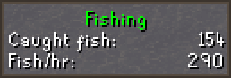

# Fishing Configuration

## Settings

### Display only currently fished fish

Configures whether fishing spots are only displayed for the fish you are currently fishing.

#### Disabled

#### Enabled

### Display spot tiles

Configures whether the tiles for fishing spots are highlighted.

### Display spot icons

Configures whether to display an icon for the fish available in the fishing spot.

### Display spot names

Configures whether names for fishing spots are displayed.

### Overlay Color

The color of highlighted fishing tiles.

### Minnows Overlay Color

The color of the Minnows fishing spot overlay when a flying fish appears.

### Aerial Overlay Color

Color of the Aerial Fishing overlay when you are close enough to 1 tick catch.

### Reset stats

The amount of time until your fishing data is reset and the overlay and infobox are removed.

### Show Fishing session stats

Displays an infobox with fishing stats.

### Show Minnow Movement overlay

Displays a progress pie that shows when Minnow fishing spots will move.

### Trawler activity notification

Sends a notification when Fishing Trawler activity drops below 15%.

### Trawler time in MM:SS

Displays a more accurate timer for the Fishing Trawler minigame.
