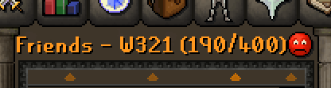
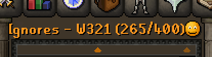
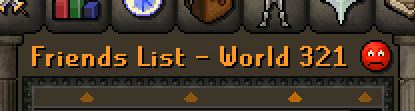
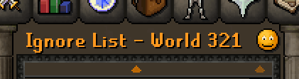

# Friend List Configuration

The `Friend List` plugin changes the text of the friends and ignore list title bar to display the total number of people you have added out of the allocated 400. 

There are no settings to configure.

### Enabled

### Disabled

