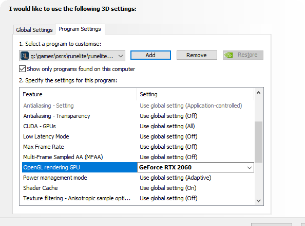

# Requirements
The GPU plugin requires Windows (7, 8, 10, or 11), MacOS, or Linux, a GPU with support for OpenGL 4.3 or newer, and 2GB of VRAM. This requires either a Nvidia GeForce 400 or newer, an AMD Radeon HD 5000 Series or newer, or Intel HD Graphics with an Intel Haswell processor or newer. Ensure your GPU drivers are up to date.

It is possible there are configurations on which the GPU plugin does not work correctly. In particular, we recommend you do not enable it in dangerous situations ingame (HCIM!) until you sufficiently test whether the plugin is stable on your system.

## The plugin keeps turning itself off!
The plugin will turn off automatically if it is not supported on your current setup. If your system meets the requirements, but the plugin still turns itself off, see the troubleshooting steps below.

## I meet the **ALL** the requirements, but it still won't turn on or is very laggy?
If you have a Nvidia GPU, make sure you are using the 32 or 64 bit version of RuneLite, not the For All Platforms Version. Then go into NVIDIA Control Panel -> Manage 3D settings -> Program settings. Click Add and find RuneLite on the list, add it. In the lower section, find the OpenGL rendering GPU option, and set it to your NVIDIA GPU. When finished, it should look something like this:

## When I turn on Anti Aliasing weird lines appear
If you have an AMD graphics card, roll back the driver to version 18.12.1

## I'm getting incredibly high memory usage while using the GPU!
If you have an AMD graphics card, roll back the driver to version 18.12.1

## The client crashes when I enter a new location
If you have an AMD graphics card, roll back the driver to version 18.12.1

## There are two mouse cursors when GPU is on
If you have a program called playstv, turn it off.

## Green stripes are appearing on my screen
This bug seems to be caused by changes in the Intel graphics drivers. the `27.20.100.xxxx` drivers can produce green lines at the time of writing. Downgrading back to the `26.20.100.xxxx` drivers seems to be resolving this problem.

## Client has low FPS during background compute operations
Disable Compute Shaders from the GPU plugin options and toggle the plugin off and back on. Use of mining software or video rendering are common GPU compute loads.

## My game is flickering

Open the Nvidia Control Panel, open "Manage 3D Settings" under the 3D settings group, select "Program Settings", add RuneLite (it can be easily found under your recently-opened programs), apply the following settings, and relaunch RuneLite:

* Monitor Technology: Fixed Refresh Rate
* OpenGL Rendering GPU: _Set to your graphics card_
* Vertical Sync: Off

## Text/Game ui is slightly blurry or weird looking

This can be caused by multiple things

### DPI scaling
The launcher will be automatically scaled by Windows if you have scaling in Windows enabled. You can override the amount that the launcher is scaled by passing the `--scale` argument to the launcher. For example `--scale=1.0` will cause RuneLite to not be scaled, even if scaling is enabled in Windows.

### Graphics drivers forcing AntiAliasing
Drivers can force certain AA levels or types, and when the GPU plugin is on it will be forced to use those, making the ui look different than normal.

For Nvidia drivers go into `NVIDIA Control Panel -> Manage 3D settings` for managing its settings
* Set `Antialiasing - FXAA` to off 
* Set `Antialiasing  - Mode` to Application-controlled

# Card Specific Issues

## AMD Radeon RX 5700 XT

Symptom: GPU driver crash (black screen) when turning on or using the GPU plugin

Solution: Disable hardware acceleration using method 2 found here https://github.com/runelite/runelite/wiki/Disable-Hardware-Acceleration#method-2-starting-the-launcher-with-hw-accel-disabled-from-cmd
