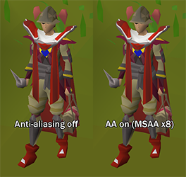

# GPU Configuration

## Settings

### Draw Distance

Draw distance counted in game tiles. Max value is 90.

Note: Extended draw distance (>25) not currently available on MacOS.

### Remove Color Banding

Smooths out the color banding that is present in the CPU renderer.

### Anti Aliasing

Configures the anti-aliasing mode.

### UI Scaling mode

Sampling function to use for the UI in [stretched mode](https://github.com/runelite/runelite/wiki/Stretched-Mode)

#### Nearest Neighbor
#### Bilinear
#### Bicubic (Mitchell)
#### Bicubic (Catmull-Rom)
#### xBR

### Fog Depth

Distance from the edge of scene at which to start drawing fog. Max value is 100.

### Compute Shaders

Enables extended draw distance on supported devices.
