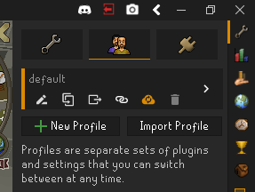

# General RuneLite features
The RuneLite settings can be found as a plugin. See [RuneLite](https://github.com/runelite/runelite/wiki/RuneLite) for more information about the various settings the client has to offer.

RuneLite incorporates functions such as:
* Moving overlays
* Hiding the sidebar

## Moving overlays
It's possible to move overlays and infoboxes by holding the <kbd>Alt</kbd> key and dragging them to a desired position. Whilst dragging blue squares will show fixed positions where they can be locked in.

You can reset an overlay's size and position by holding the <kbd>Alt</kbd> key and right-clicking the overlay.

## Hiding the sidebar
It's possible to hide the sidebar by pressing the left arrow next to the minimize button. To show the sidebar again press the right arrow. This can also be done using the shortcut keys ctrl+F11.

### Profiles

Profiles are separate sets of plugins and settings that can be switched between at any time. They can be managed under a tab in the configuration panel.

Below each profile are buttons to interact with them. Toggled buttons will turn orange to indicate they are enabled. From left to right, the buttons are: 
 1. Rename profile
 2. Duplicate profile
 3. Export profile
 4. Set profile as default for the current RuneScape account
     - Must be logged in to the game using a RuneScape account
 5. Enable cloud sync
     - Must be logged in to the client using a RuneLite.net account
 6. Delete profile
 
Additionally, profiles can be dragged to re-order them.

By default the profile loaded on startup will be the one that was most recently active. To load a specific profile on startup you can pass `--profile=<profilename>` to the launcher.

Advanced users that previously utilized the old method of passing a `--session` and/or `--config` parameter should now instead use `--profile`.  An import feature was included to facilitate taking all the distinct settings created by those and creating profiles from them, simply select to import and navigate to the directory containing the settings and select them individually. 

More info on the importing procedure can be found in [[this FAQ entry | FAQ#how-do-i-convert-the-previous-multi-sessionsetting-file-to-a-profile]]
