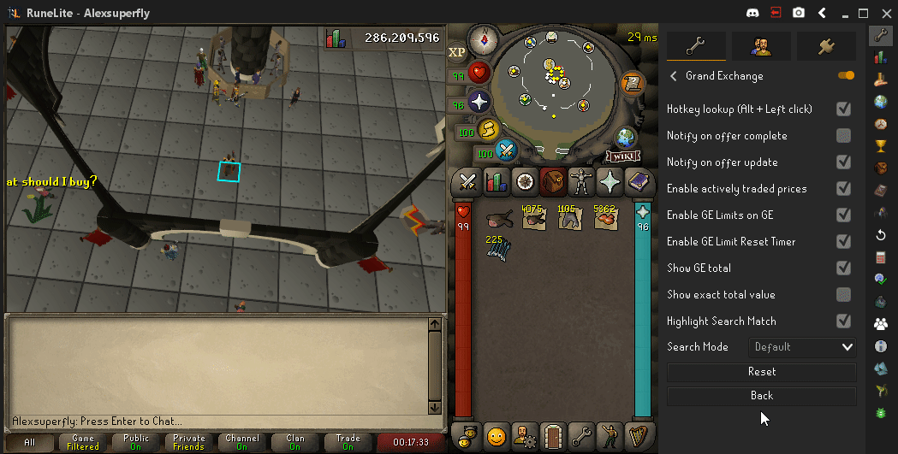

# Grand Exchange Configuration

This plugin, when enabled, allows the user to 'Alt + Left Click' on an item sold in the GE and lookup that item in the GE tab on the side.

## Settings

### 1. Hotkey Lookup (Alt + Left click)

(Default On) If disabled, you will have to search for the item manually in the GE tab on the right-hand side of the client, look for the  icon.

