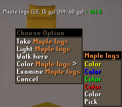
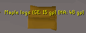
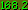
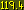
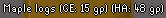
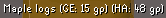

# Ground Items Configuration

The Ground Items plugin highlights ground items and/or displays their Grand Exchange or High Alchemy information

## Item Lists

### Highlighted Items

Configures specifically highlighted ground items. 

* **Format:** `item`, `item`
* **Format:** `item<5`, `item>5` to filter based on quantity

### Hidden Items

Configures hidden ground items. 

* **Format:** `item`, `item`
* **Format:** `item<5`, `item>5` to filter based on quantity

## Per-item colors

You are able to change the color of specific items via the shift+right-click menu.
This feature will highlight the item based on the items ID, so Easy/Medium/Hard/Elite clue highlighting will only highlight that specific step. 

 

## Settings

### Show Highlighted items only

Configures whether or not to draw items only on your highlighted list.

### Do not hide untradeables

Configures whether or not untradeable items ignore hiding under settings.

### Show Menu Item Quantities

Configures whether or not to show the item quantities in the menu.

### Recolor Menu Hidden Items

Configures whether or not `hidden items` in the right-click menu will be recolored.

### Highlight Tiles

Configures whether or not to highlight tiles containing ground items.

### Notify for Highlighted drops

Configures whether or not to notify for drops on your highlighted list.

### Notify Tier

Configures which price tiers will trigger a notification on item drop. Tiers valued higher than the option you select will also be included.

### Price Display Mode

Configures which price types are shown alongside ground item name.

### Item Highlight Mode

Configures how ground items will be highlighted.

### Menu Highlight Mode

Configures what to highlight in the right-click menu.

### Highlight Value Calculation

Configures which coin value is used to determine highlight color.

### Hide under value

Configures hidden ground items under both GE and HA value.

### Default items color

Configures the color for default, non-highlighted items

### Highlighted items color

Configures the color for highlighted items.

### Hidden items color

Configures the color for hidden items in the right-click menu and when holding `Alt`.

### Low value items color

Configures the color for low value items.

### Low value price

Configures the start price for low value items.

### Medium value items color

Configures the color for medium value items.

### Medium value price

Configures the start price for medium value items.

### High value items color

Configures the color for high value items.

### High value price

Configures the start price for high value items.

### Insane value items color

Configures the color for insane value items.

### Insane value price

Configures the start price for insane value items.

### Ownership filter

Options for deciding which type of loot displays.

All - All
Takeable - Any Loot/Items you can pick up, including your (GIM)group loot
Drops - Enemy drops for you, and your (GIM)group loot

### Double-tap delay

Delay for double-tapping `ALT` to hide. Decrease this number if you accidentally hide ground items often. `0` = Disabled.

### Collapse ground item menu

Collapses ground item menu entries together and appends count.

### Despawn timer

Shows a green timer   that counts down until items dropped or received as loot are visible to other players.

Shows a yellow timer   that counts down until items dropped or received as loot, despawn.

### Text Outline

Use an outline around text instead of a text shadow.

 vs 

### Highlighted item lootbeams

Configures lootbeams to show for all items in the `Highlighted Items` section.

### Lootbeam tier

Configures which price tiers will trigger a lootbeam. Tiers valued higher than the option you select will also be included.

### Lootbeam Style

Style of lootbeam to use

### Hotkey

Configures the hotkey used by the plugin for showing/hiding ground items.
