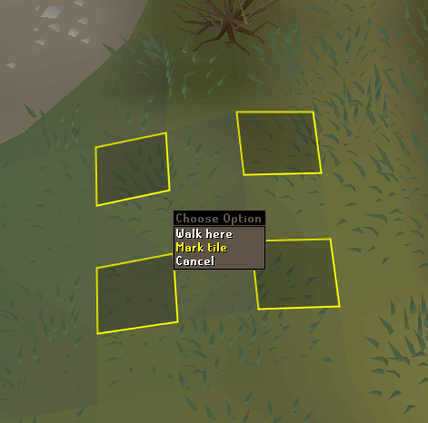
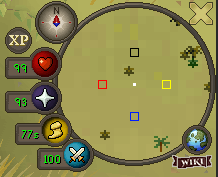

# Ground Marker Configuration

The Ground Markers plugin allows user to mark tiles around the world. Marking tiles can be done by holding the **shift key** and right clicking the tile you want to mark and then click "Mark tile" in the menu.

Removing a marked tiles follows the same principle, shift right click the tile and select the menu option again to remove the tile.

Marked tiles can also be labeled by shift right clicking the desired previously marked tile.

The plugin also remembers which tiles you have marked between sessions.

## Settings
---

### Border width
In pixels.
### Draw tiles on the minimap

### Fill Opacity
Makes marked tiles darker. 0 (fully transparent) - 255 (fully opaque).
### Remember color per tile
When this is on, changing the tile color will not change the color of existing ground markers, only new ones will use the current tile color.
### Show Import/Export/Clear options
Show these menu options when right-clicking the world map orb by the minimap.
### Tile color
The color of the ground markers. Supports transparency.

## Importing / Exporting
---
Right-click the World Map orb by the minimap to import or export ground markers. Importing will check your system clipboard for a ground marker import string. Exporting will copy the ground markers in the area around you to the system clipboard.

Ground marker import strings look like this: `[{"regionId":12850,"regionX":22,"regionY":19,"z":0,"color":"#FF000000"},{"regionId":12850,"regionX":21,"regionY":19,"z":0,"color":"#FFDC8700"}]`.

To export all tile markers, sign in to runelite and enable cloud sync on the profile that has the tile markers, then visit https://runelite.net/account/tile-markers and click "Export Tile markers".
