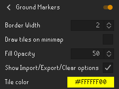
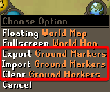

# Ground Marker Configuration

The Ground Markers plugin allows user to mark tiles around the world. Marking tiles can be done by holding the **shift key** and right clicking the tile you want to mark and then click "Mark tile" in the menu.

You are able to do the following with a marked tile in that same shift right click menu:

- Unmark (delete)

- Label

- Color

The plugin also remembers which tiles you have marked between sessions.

--- 

## Settings

### Border width

Controls how thick the border of the tiles are.

### Draw tiles on the minimap

Displays the marked tiles on the minimap.

### Fill Opacity

Makes marked tiles darker. 0 (fully transparent) - 255 (fully opaque).

 

### Show Import/Export/Clear options

Show these menu options when right-clicking the world map orb by the minimap.

### Tile color
The color of the ground markers. Supports transparency.

---

## Importing / Exporting

Right-click the World Map orb by the minimap to import or export ground markers. Importing will check your system clipboard for a ground marker import string. Exporting will copy the ground markers in the area around you to the system clipboard.

Ground marker import strings look like this: `[{"regionId":12850,"regionX":22,"regionY":19,"z":0,"color":"#FF000000"},{"regionId":12850,"regionX":21,"regionY":19,"z":0,"color":"#FFDC8700"}]`.

To export all tile markers, sign in to RuneLite and enable cloud sync on the profile that has the tile markers, then visit https://runelite.net/account/tile-markers and click "Export Tile markers".
