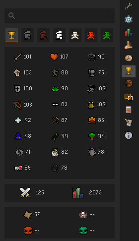
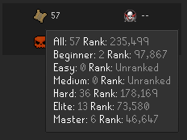
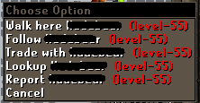

## HiScore Configuration
Displays a button to open the Hiscore panel.

## Features
### Self-lookup

Double-click the magnifying glass in the search bar to lookup your own character.

### HiScores for different game modes

Click the tabs along the top to switch between different game modes such as Ironman.

### Hover for more details

Hover over any stat to see more details. For example, a breakdown of the cluescrolls by type.

## Settings
### Player option

Shows the lookup option when right clicking another player.

### Menu option

Shows the lookup option when right clicking another player's name in menus such as the chatbox or friends list.

### Display virtual levels

Displays levels over 99.

### Autocomplete

Predicts the name you are trying to type based on your friends list, clan chat and nearby players.

### Bounty lookup

Automatically lookup the stats of your Bounty Hunter target.
