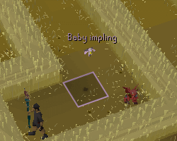

# Implings Configuration

The Implings plugin can highlight nearby implings on the minimap and on-screen, as well as be configured to send a notification when selected implings come into view.

## Settings

### Show Spawn locations

Configures whether or not spawn locations are displayed while in Puro Puro.

### Impling Spawn color

Text color for spawn locations in Puro Puro.

### Show name on minimap

Configures whether or not to display impling names on the minimap.

## Impling Type Settings

This section allows you to configure impling-specific settings.

### Show
* **None:** Ignore the impling.
* **Highlight:** Highlight the impling's location.
* **Notify:** Sends a notification when the impling comes into view, as well as highlight the impling's location.

### Color

Configures the color for the text and highlight of each respective impling.

