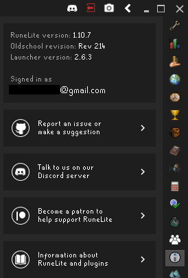

## Info Panel Configuration
Displays a sidebar button to open the Info Panel.  
The Info Panel shows various information such as:  
* RuneLite version  
* Oldschool engine version  
* RuneLite launcher version  
* Login status (RuneLite account)  
* A link to report an issue on GitHub  

