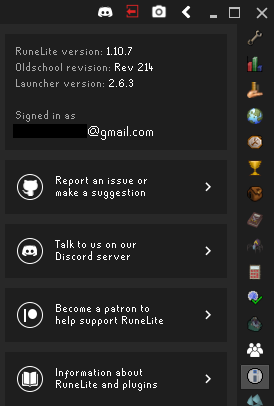

## Info panel Configuration
Displays a button to open the Info panel  
The Info panel shows various information such as:
* RuneLite version
* OldSchool Engine version
* Login status (Cloud sync settings status)
* A link to report an issue on GitHub  

