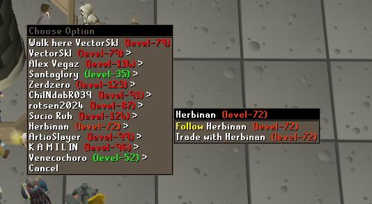

# Interface Styles Configuration

This plugin allows you to change the interface style, left-click cross animation, health bars, and right-click menu style.
## Settings

### Always stack bottom bar
When in **resizable mode**, always stack the interface tiles regardless of screen size.

#### Disabled

#### Enabled

### Condense player options
When enabled player options will be collapsed into a submenu for each player.

### Gameframe
The style of the game interfaces.

#### 2005

#### 2006

#### 2010

### High Detail health bars
Replaces health bars with the RuneScape High Detail mode design.

### High Detail menu
Replaces game menu with the RuneScape High Detail mode design.

### Menu Alpha
Configures the transparency of the right-click menu on a `0`-`255` scale.

### RuneScape cross sprites
Replaces left-click cross sprites with the ones from RuneScape.

