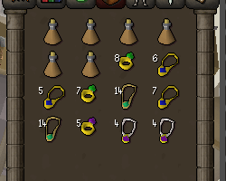

# Item Charges Configuration

Displays the number of remaining charges for various items.

## Settings

### Very low Warning Color

Configures the color of the overlay when charges are very low.

### Low Warning Color

Configures the color of the overlay when charges are low.

### Very Low Warning

Configures the charge count for the very low warning color.

### Low Warning

Configures the charge count for the low warning color.

### Show Infoboxes

Configures whether to show an infobox with remaining charges for equipped items.

## Charge Settings

### Show Teleport Charges

Configures if teleport item charge count is shown.

### Dodgy Necklace Count

Configures if Dodgy Necklace charge count is shown.

### Show Imp-in-a-box charges

Configures if imp-in-a-box charge count is shown.

### Show Fungicide 

Configures if Fungicide charge count is shown.

### Show Watering Can Charges

Configures if Watering Can charge count is shown.

### Show Waterskin Charges

Configures if Waterskin dose count is shown.

### Show Bellow Charges

Configures if remaining Bellow item charge is shown.

### Show Basket Charges

Configures if Fruit Basket item count is shown.

### Show Sack Charges

Configures if Sack item count is shown.

### Show Abyssal Bracelet Charges

Configures if Abyssal Bracelet charge count is shown.

### Show Amulet of Chemistry Charges

Configures if Amulet of Chemistry charge count is shown.

### Show Amulet of Bounty Charges

Configures if Amulet of Bounty charge count is shown.

### Show Binding Necklace Charges

Configures if Binding Necklace charge count is shown.

### Show Explorer's Ring Alch Charges

Configures if Explorer's Ring alchemy charges are shown.

### Show Ring of Forging Charges

Configures if Ring of Forging charge count is shown.

### Show Potion Doses

Configures if potion doses are shown.

## Notification Settings

### Dodgy Necklace Notification

Configures if a notification is sent when a Dodgy Necklace breaks.

### Ring of Recoil Notification

Configures if a notification is sent when a Ring of Recoil breaks.

### Binding Necklace Notification

Configures if a notification is sent when a Binding Necklace breaks.

### Ring of Forging Notification

Configures if a notification is sent when a Ring of Forging breaks.
