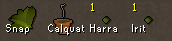

# Item Identification Configuration

The Item Identification plugin overlays herbs, saplings, and seeds with their names (or abbreviations) to help quickly identify them in the bank, inventory, seed vault, and other interfaces.

## Settings

### Identification Type

How much to show of the item name.

### Color

The color of the identification text.

## Categories

### Gems

Show identification on gems.

### Herbs

Show identification on Herbs

### Impling jars

Show identification on Impling jars.

### Ores

Show identification on Ores.

### Potions

Show identification on Potions.

### Saplings

Show identification on Saplings and Seedlings.

### Seeds

Show identification on Seeds.
