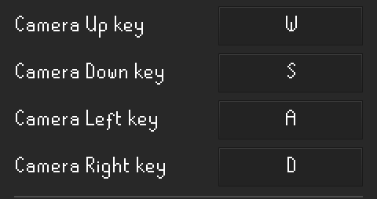
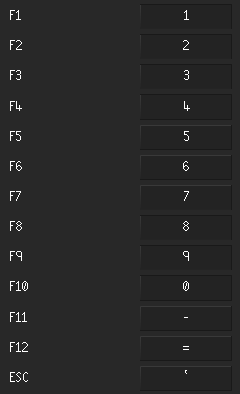

# Key Remapping Configuration

Enables `Press Enter to Chat...` mode in the chat box, preventing text input unless Enter is pressed beforehand. Allows for the remapping of keys for camera movement, F-Keys, and Space.

## Camera Remapping

### Remap Camera

Configures whether the camera movement uses remapped keys. By default, the keys get remapped to WASD, but they can be reconfigured.

## F Key Remapping

### Remap F Keys

Configures whether the F-Keys use remapped keys. 

## Other

### Space

Configures whether the `Space` key is remapped when in dialogues.

### Control

Configures whether the `Control` key is remapped.
