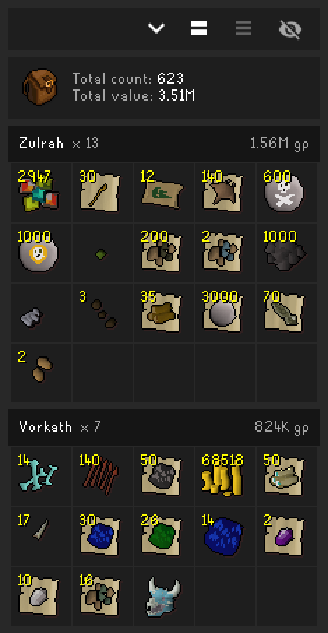
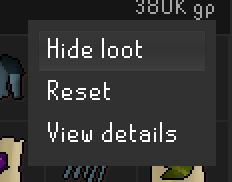
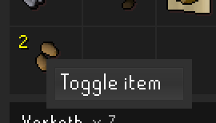
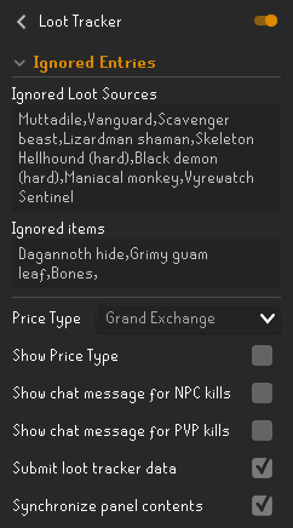

# Loot Tracker

The Loot Tracker plugin adds a sidebar panel which tracks the contents and value of items dropped while killing monsters, other players, and drops from some other activities such as Barrows, Chambers of Xeric, Theatre of Blood, and Clue Scrolls.

## Usage

  Collapse loot

 Group loot by source or individual kill.

 Show/Hide hidden loot

To show/hide individual items or all loot from a specific NPC, use right-click:

 

## RuneLite Account

While logged in with a RuneLite [Account](https://github.com/runelite/runelite/wiki/Account), the loot tracker will remember your loot across client restarts. Loot for a particular event (such as Barrows, a clue scroll reward, or a drop from Zulrah) will be kept until 90 days after the most recent loot for that specific event. If you receive loot from an event at least once every 90 days the loot will be remembered indefinitely.

The loot can also be reviewed on the website at https://runelite.net/account/loot-tracker

# Loot Tracker Configuration

## Ignored Entries

### Ignored Loot Sources

Hide specific NPCs or sources of loot in the loot tracker (e.g., Goblin, Barrows Chest, H.A.M. Member).

### Ignored Items

Configures which items should be hidden from the loot tracker.

***

### Price Type

Configures which type of price to use for calculating value.

### Show Price Type

Configures whether to show `GE` or `HA` next to the total values in the loot tracker.

### Show chat message for NPC kills

Adds a chat message with NPC name and kill value when receiving loot.

### Show chat message for PVP kills

Adds a chat message  with player name and kill value when receiving loot from a player kill.

### Submit loot tracker data

Submit loot tracker data to your RuneLite account (requires being logged in).

### Synchronize panel contents

Synchronize your local loot tracker with your server data (requires being logged in).

The panel is filled with portions of your remote data on startup and deleting data in the panel also deletes it on the server.
