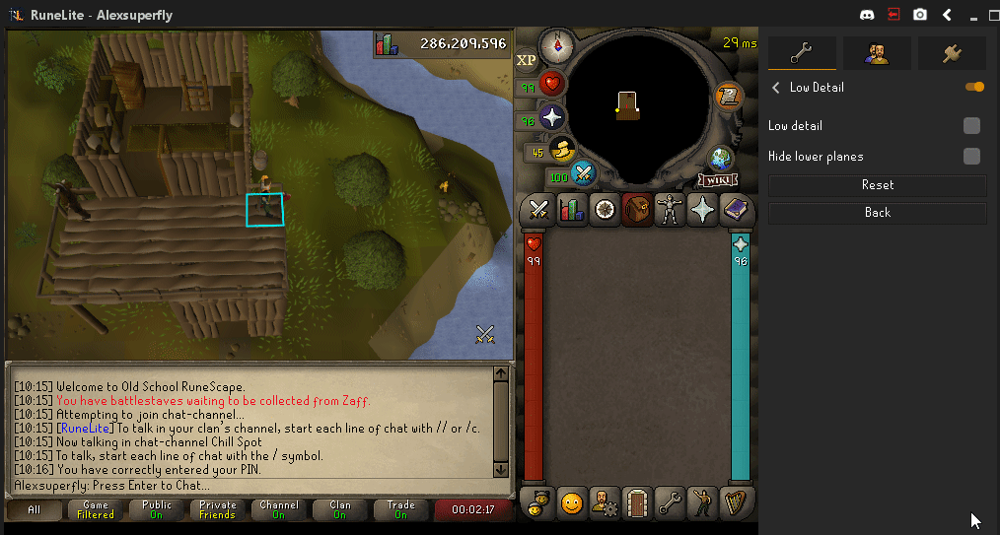

# Low Detail Configuration

(Default Off) The game will run in low detail, reducing memory usage. When enabled, ground decorations (like pebbles and grass), and some textures are turned off.

## Warning:

Please note, Low Detail mode can cause some textures to not render or disappear (e.g. Seer's Rooftop Agility). Turning off this plugin and restarting the client will fix this.
