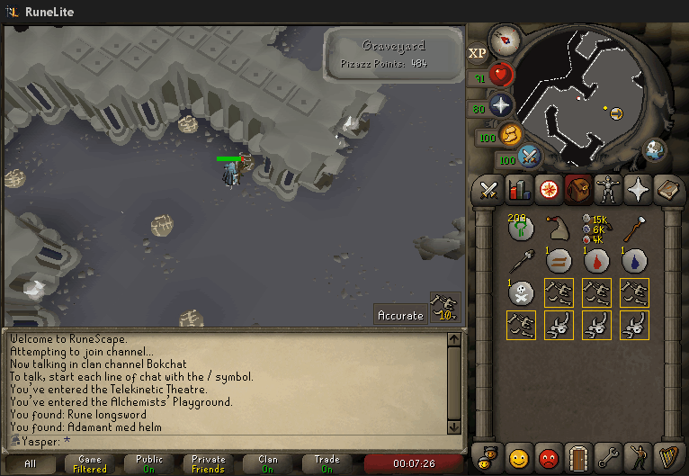
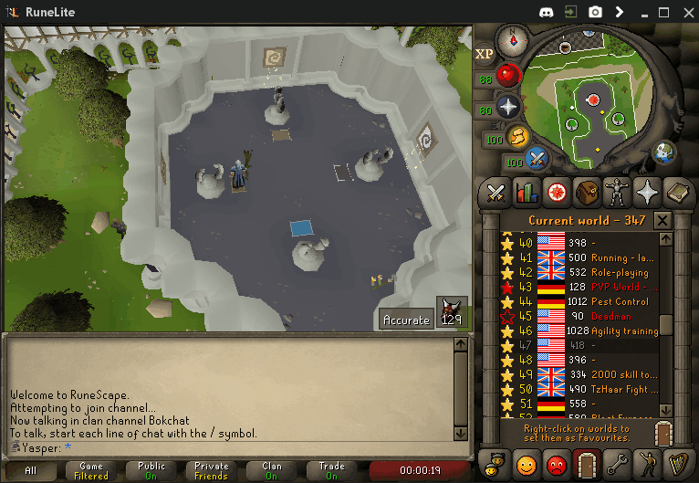

The Mage Training Arena plugin adds a number of overlays for each of the four training rooms to simplify the minigame.

## Telekinetic Theatre

The Telekinetic room overlay shows you on which side of the maze to stand and it shows you when you are able to cast the telekinetic grab spell correctly. The colors of the tiles that it indicates for you to stand on turn green when you are able to cast the spell. The plugin also offers the ability to instead of one tile draw the line of tiles on which you are able to stand to correctly cast the spell.

## Alchemists' Playground

The Alchemy room overlay shows you in what cupboard what item is based on the items you have previously gotten. This room operates on rotations and the order of the items in the cupboard is always the same. This allows you to devise an item's location based on other items you have found. The overlay will also highlight items in your inventory that give the most points. The plugin also allows you to change from icons to text.

## Creature Graveyard

The Graveyard room is a lot less complex than the other two. This overlay will add a counter infobox displaying how many fruit your bones will get you and the color changes depending on whether this is enough for a point.The games bones widget is hidden as it is rendered useless by this plugin and may interfere with the counter boxes. This room also has an overlay for your inventory that turns green when the points of the bones in your inventory are enough to get a graveyard point. This overlay is off by default and can be turned on from the config.

## Enchanting Chamber

Has a simple counter for the enchantment room showing how many dragonstones have spawned. This plugin will also hide the widgets of the room since they are not used by anyone who does this room. The room also uses hint arrows to indicate where the dragonstones are.

## Settings

### Enable alchemy room

Configures whether or not the alchemy room overlay is enabled.

### Enable graveyard room

Configures whether or not the graveyard room overlay is enabled.

### Enable telekinetic room

Configures whether or not the telekinetic room overlay is enabled.

### Enable enchantment room

Configures whether or not the enchantment room overlay is enabled.
