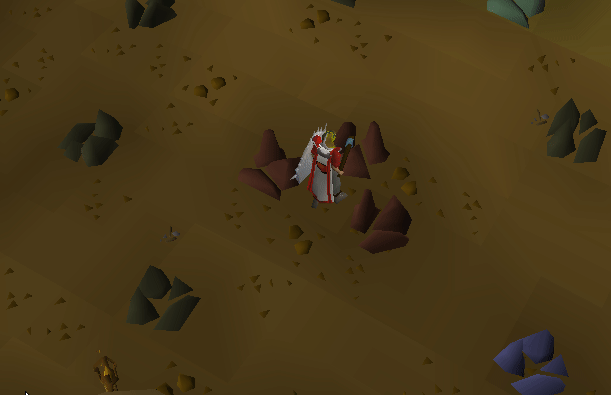

The mining plugin adds respawn timers to mining rocks.

In the Motherlode Mine the respawn timer will turn green when it reaches the minimum respawn time, indicating that the vein could respawn at any time before the timer expires.

