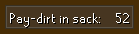
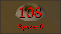
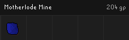
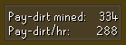
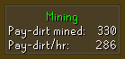
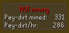
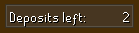
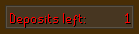
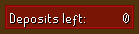
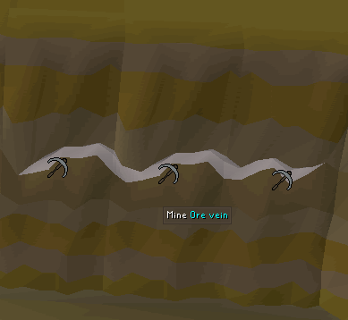

# Motherload Mine Configuration

## Settings

### Show pay-dirt sack

Configures whether to display the amount of pay-dirt in the sack is or not.  

  

### Reset stats (minutes)

Configures the time until statistics are reset.

### Show gems found

Shows gems found during mining session.  

### Show mining session stats 

Displays pay-dirt mined and pay-dirt/hr.

### Show current mining state

Shows current mining state if mining session stats are enabled.

  

### Show deposits left

Displays the number of deposits before sack is full.  

  
  

### Show pay-dirt mining spots

marks pay-dirt veins and rock obstacles.  

