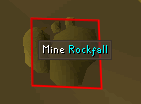

# Motherload Mine Configuration

We use the default overlay for tracking how much pay-dirt is in the sack.

 

## Settings

### Reset stats (minutes)

Configures the time until statistics are reset.

### Show broken struts

Shows an overlay when a Water wheel has a Broken strut and needs repair.

### Show current mining state

Shows current mining state if mining session stats are enabled.

  

### Show mining session stats 

Displays pay-dirt mined and pay-dirt/hr.

### Show pay-dirt mining spots

Shows an overlay on the pay-dirt veins.  

### Show rocks obstacles

Shows an overlay on Rockfall's blocking your path around the mine.

### Track gems found

Shows gems found during mining session in the Loot Tracker.  

### Track ores found

Shows ore found during mining session in the Loot Tracker.

