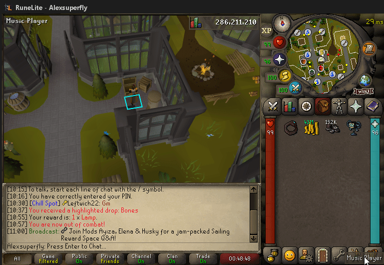

# Mouse Tooltips Configuration

The plugin will render _most_ text that is typically displayed in the top left corner, except common options like "Walk here", "Cancel", "Continue" and "Move" (for sliding puzzles)

## Settings

### 1. Interface Tooltips

(Default On) Displays interface tooltips.

### 2. Chatbox Tooltips

(Default On) Displays tooltips in the chatbox.
