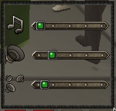

# Music Plugin Configuration
Adds search and filter for the music list

The plugin will also allow you to control the in-game volume with more granularity.

## Usage

Clicking on the status button will cycle through displaying unlocked, locked, and all music tracks. Clicking on the search button will open a search dialog which will filter the visible music tracks based on the input.

## Settings

### 1. Mute player area sounds

(Default Off) Mute area sounds caused by yourself

### 2. Mute others' area sounds

(Default Off) Mute area sounds caused by other players

### 3. Mute NPCs' area sounds

(Default Off) Mute area sounds caused by NPCs

### 4. Mute environment area sounds

(Default Off) Mute area sounds caused by neither NPCs nor players

### 5. Mute prayer area sounds

(Default Off) Mute prayer activation and deactivation sounds

### 6. Granular volume sliders

(Default On) Make the volume sliders allow better control of volume
