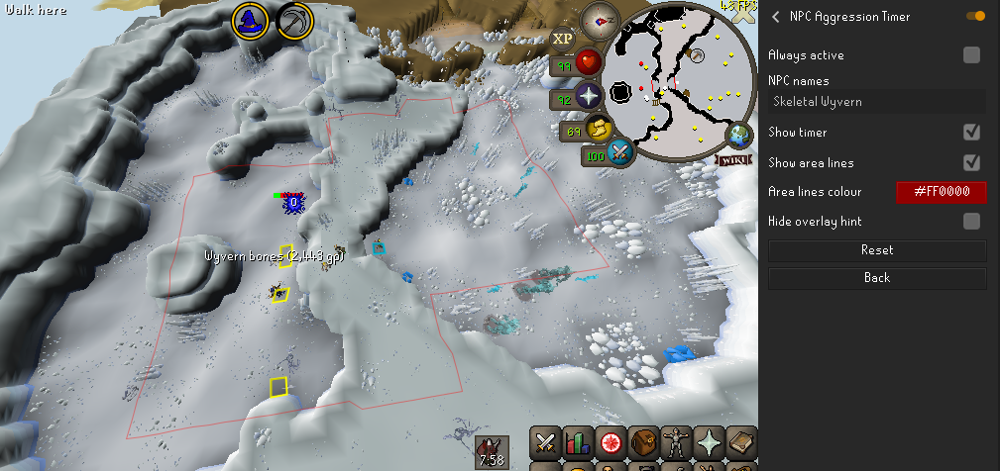
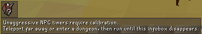

# How it works

You may see this infobox when trying to use the plugin. Place your mouse over it and follow its instructions to get the timer to start working.

The reason for this is that the game remembers 2 tiles. When you move over 10 steps away from both tiles the oldest one is moved to under you and the NPC aggression timer resets. In order for the plugin to figure out where those tiles are you must first teleport away (entering a dungeon also counts as a "teleport") so that you are out of the radius of both those tiles, thus resetting them so that the plugin can begin tracking them.  
The easiest way to do this is to teleport to Lumbridge, and step over the bridge to Al Kharid.

# NPC Aggression Timer Plugin Configuration

### Always active
Enable this to always the display the timer and area line overlays if they are enabled. Alternatively see: [NPC names](https://github.com/runelite/runelite/wiki/NPC-Aggression-Timer#npc-names)

### NPC names
If the [Always active](https://github.com/runelite/runelite/wiki/NPC-Aggression-Timer#always-active) option is not enabled, then the plugin will only show overlays in the presence of the NPCs listed in this box. Enter the names of NPCs, separated by commas, in the presence of which you would like to see NPC aggression timers. You can use wildcards e.g. `*wyvern, *dragon` to have the timers show in the presence of all wyverns and dragons.

### Show timer
Enable to display an infobox with a timer for how long until NPCs become unaggressive towards you.

### Show area lines
Display the border of the area in which you can stay without resetting the NPC aggression timer.

### Area lines colour
Configure the colour of the area lines.

# Common problems

### Rock crabs, sand crabs and ammonite crabs

If using the [NPC names](https://github.com/runelite/runelite/wiki/NPC-Aggression-Timer#npc-names) option then you need to enter the name of the NPC's rock form into the input box e.g. `fossil rock`.
