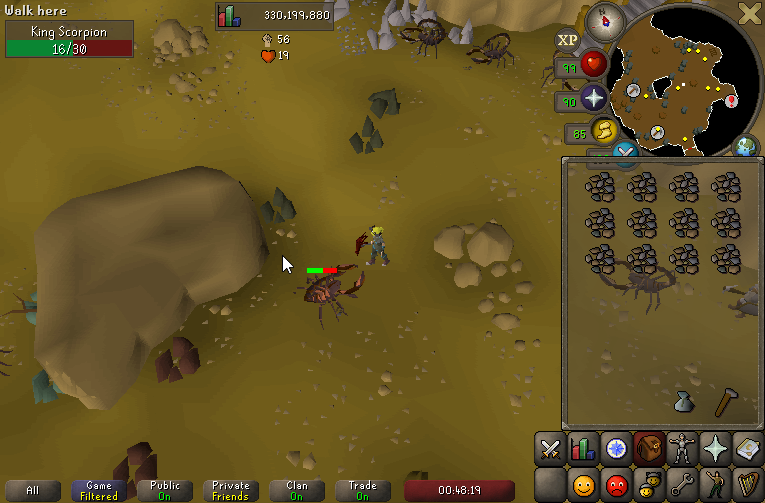
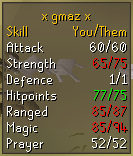

## Opponent Information Configuration

Show a widget containing the name of the NPC you are currently fighting, its current and total hitpoints. NOTICE! The current hp might not be 100% accurate, some NPCs might show a percentage instead of an hp value if we don't have the data on that specific NPC.

## Settings

### Lookup players on interaction

Displays a combat stat comparison panel when interacting with other players. (Following, trading, challenging, attacking, etc.)

