# Features

Party Members can "ping" a tile, which will show up for all party members. Requires setting the ping hotkey in the plugin configuration.

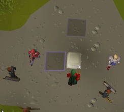

Party Members will show up on the world map

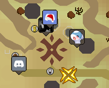

If you're using the Special Attack Counter plugin, it will show the special attacks done by your party members. Including adding them to infoboxes, and showing spec drops.

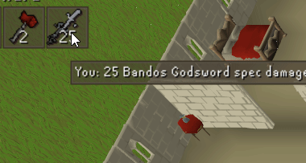

If you're using the DPS Counter plugin, the Party plugin will allow you to see the DPS of everyone else in your party as well

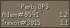

# How to Create a Party

1. Make sure the `Party` plugin is enabled.

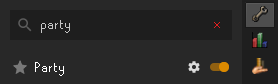

2. Click the Party panel icon in the sidebar.

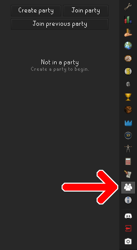

3. Click `Create party`.

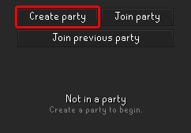

4. Congratulations, the party is now created! :tada: Click `Copy passphrase` and paste the phrase to your friends to allow them to join.

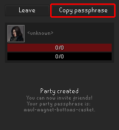

# How to Join a Party

1. Make sure the `Party` plugin is enabled.

2. Click the Party panel icon in the sidebar.

3. Click `Join party`.

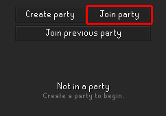

4. In the popup box, enter the passphrase that the party creator gave you.

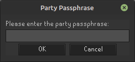

5. Congratulations, you are now in the party! :tada:

Note: If you are trying to rejoin a party you just left (e.g. if you had to restart your client), you can simply press the `Join previous party` button instead of having to enter the passphrase again.

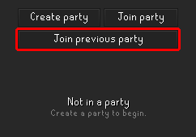

# How to Leave a Party

1. Click the Party panel icon in the sidebar.

2. Click the `Leave` button.

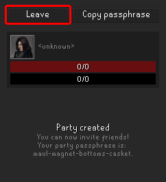
