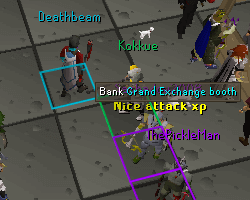
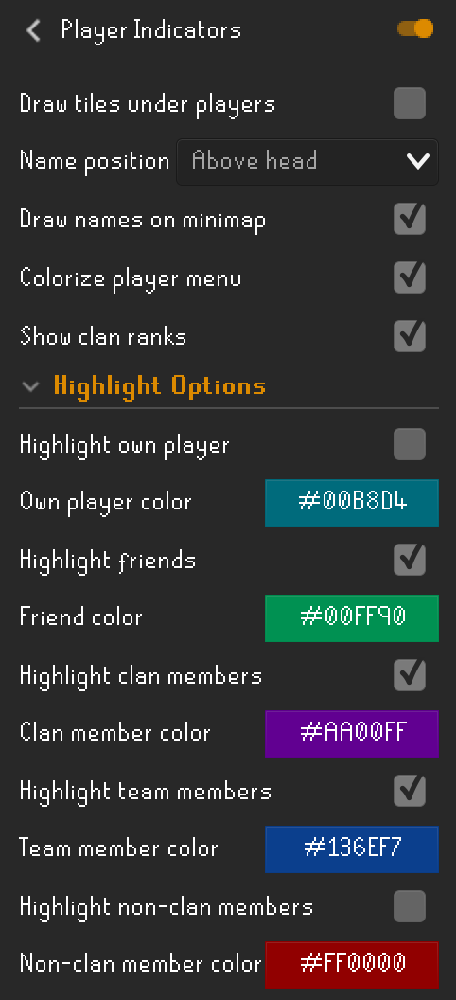

# Player Indicators Configuration

Highlight players on-screen and/or on the minimap.

## Settings

### Draw tiles under players

Configures whether or not tiles under highlighted players should be drawn.

### Name position

Configures the position of drawn player names, or if they should be disabled.

### Draw names on minimap

Configures whether or not minimap names for players with rendered names should be drawn.

### Colorize player menu

Color right click menu for players.

### Show clan ranks

Add clan rank to right click menu and next to player names.

## Highlight Options

### Highlight own player

Configures whether or not your own player should be highlighted.

### Own Player color

Color of your own player highlight.

### Highlight friends

Configures whether or not friends should be highlighted.

### Friend color

Color of friend names highlight.

### Highlight clan members

Configures whether or clan members should be highlighted.

### Clan member color

Color of clan members highlight.

### Highlight team members

Configures whether or not team members should be highlighted.

### Team member color

Color of team members highlight.

### Highlight non-clan members

Configures whether or not non-clan members should be highlighted.

### Non-clan member color

Color of non-clan member highlight.
